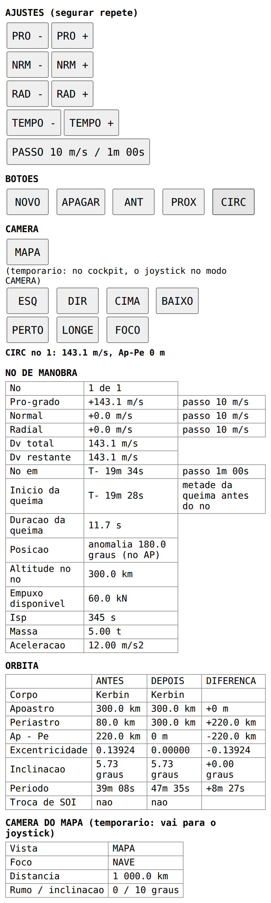

# Editor de nós de manobra

**Pronto quando:** dá para planejar uma circularização pelo editor, olhando o nó no mapa do jogo, sem tocar no mouse.

O editor de nós de manobra da [fase 4](../README.md#fase-4--instrumentos-físicos) vai ter 4 teclas basculantes com mola (como a do TIME WARP) e alguns botões no painel, sem tela própria: os números do nó vão para uma página do editor na tela multifunção, que abre sozinha quando o editor é usado. Enquanto o hardware não existe, as teclas e os botões viram botões numa página web, com as tabelas do nó embaixo. A página abre no navegador do PC ou do celular, pelo Wi-Fi.

```
 KSP + kRPC (PC)
      │ chamadas do kRPC (lê e mexe nos nós, na câmera do mapa)
      ▼
 bridge/manobras.py: a ponte do editor. Faz todas as contas.
      │ HTTP: GET /estado (4 vezes por segundo), POST /linha
      ▼
 bridge/celular/manobras.html: botões + tabelas, no navegador
```

A página manda **as mesmas linhas que o painel vai mandar** pela serial (`INC PRO 1`, `BTN NOVO 1`, ver o [protocolo](protocolo.md#editor-de-nós-de-manobra)). Quando as teclas existirem, a ponte lê essas linhas da serial no lugar da página, e as contas continuam as mesmas.



**Onde estamos:** escrito e testado com um kRPC de mentira ([`bridge/tests/test_manobras.py`](../bridge/tests/test_manobras.py)), sem o jogo. Falta testar no KSP (lista no fim).

## Usar

Precisa só do que a ponte já usa (`krpc`, `pyserial`). No PC com o KSP aberto e o servidor do kRPC iniciado:

```
python bridge/manobras.py                  # KSP neste computador
python bridge/manobras.py 192.168.1.10     # KSP em outro computador
python bridge/manobras.py --porta 8001     # porta da página (padrão 8001)
```

Ele mostra o endereço para abrir no navegador. A tela multifunção usa a porta 8000, então as duas rodam juntas.

## Controles

| Botão | O que faz |
|---|---|
| `PRO -` / `PRO +` | Δv pró-grado, um passo por toque. Segurando, repete (10 por segundo), como a tecla com mola do painel |
| `NRM -` / `NRM +` | Δv normal |
| `RAD -` / `RAD +` | Δv radial (para fora do planeta) |
| `TEMPO -` / `TEMPO +` | Move o nó ao longo da órbita. Não deixa o nó a menos de 5 s de agora |
| `PASSO` | Um só para os quatro ajustes: troca o passo de todos juntos. Δv: 0.1 → 1 → 10 → 100 m/s. Tempo: 1 s → 10 s → 1 min → 10 min |
| `NOVO` | Nó novo, com Δv zero, no próximo apoastro **depois do último nó** (sem apoastro: no periastro; sem os dois: daqui a 2 min) |
| `APAGAR` | Apaga o nó escolhido; fica escolhido o seguinte |
| `ANT` / `PROX` | Troca o nó escolhido, quando há mais de um |
| `CIRC` | Acerta o nó escolhido para a órbita ficar circular no ponto onde ele está. Sem nó, cria um no apoastro |
| `MAPA` | Liga e desliga o mapa do jogo, para ver o nó sendo criado. No painel, fica na seção da câmera |
| `ESQ` `DIR` `CIMA` `BAIXO` `PERTO` `LONGE` `FOCO` | Câmera do mapa: **temporário**, ver abaixo |

"A órbita em que o nó está" é a da nave para o primeiro nó, e a que sai do nó anterior para os outros. Assim o `NOVO` depois de um nó põe o novo no apoastro da órbita já mudada pelo primeiro.

Não há botões `AP` e `PE`: o `NOVO` já cria o nó no apoastro, e o `TEMPO` leva o nó a qualquer ponto. A linha "Posição" da tabela avisa quando o nó está no AP ou no PE.

### Circularizar (CIRC)

Um toque deixa a órbita circular no ponto do nó, em qualquer ponto da órbita, não só no apoastro: `NOVO` + `CIRC` (ou só `CIRC`, sem nó) é a circularização de sempre no apoastro; `TEMPO` + `CIRC` circulariza em outra altitude.

1. **Conta fechada.** No ponto do nó, a nave está a uma distância *r* do centro, com velocidade *v* (vis-viva) inclinada *γ* acima do horizonte (ângulo de voo, tan γ = e·sen ν / (1 + e·cos ν)). A órbita circular ali pede velocidade √(μ/r), só na horizontal. A diferença, passada para o quadro do nó (pró-grado inclinado γ), é:
   - pró-grado = √(μ/r)·cos γ − v
   - radial = −√(μ/r)·sen γ
   - normal = 0 (o `CIRC` zera o normal: mudar o plano junto é outra conta).
2. **Conferência.** A ponte lê a órbita que o jogo prevê depois da queima (`node.orbit`), faz a mesma conta nela e soma a correção ao nó, até a correção ficar menor que 1 mm/s (no máximo 5 vezes). Na conta exata, a primeira correção já dá zero; a volta existe para pegar alguma diferença do jogo.
3. A mensagem mostra o Δv e o Ap − Pe que sobrou. Se o ponto estiver dentro da atmosfera ou abaixo do chão, ela avisa.

Se a nave troca de esfera de influência antes do nó, o `CIRC` recusa: a órbita de antes do nó seria outra.

## O que a página mostra

**NÓ DE MANOBRA** (o escolhido)

- Qual nó, de quantos.
- Pró-grado, normal e radial, com o passo.
- Δv total e Δv restante (o que falta, durante a queima).
- T− até o nó, com o passo do `TEMPO`.
- Início da queima: T− até começar, com **metade da queima antes do nó**, como o EXEC da fase 5 vai fazer.
- Duração da queima, pela equação do foguete: empuxo disponível, Isp e massa agora. A nave fica mais leve queimando, por isso a queima longa leva menos que massa × Δv / empuxo.
- Posição: anomalia verdadeira do nó na órbita, e `(no AP)` ou `(no PE)` quando ele está a menos de 1° deles.
- Altitude no nó, empuxo disponível, Isp, massa e aceleração.

**ÓRBITA**: antes, depois e diferença

- Corpo, apoastro, periastro, **Ap − Pe** (0 m é circular), excentricidade, inclinação e período.
- Troca de SOI: para qual corpo, em quanto tempo e o periastro lá (um encontro com a Mun aparece aqui).
- Sem nó, só a órbita de agora.

**AVISOS**: nó que já passou, nave sem motor ativo (a duração fica `--`), periastro abaixo do chão ou dentro da atmosfera.

**CÂMERA DO MAPA**: vista (mapa ou voo), foco, distância, rumo e inclinação.

A última mensagem (resultado de um botão, erro do jogo) fica 6 s acima das tabelas. Os textos são ASCII, sem acentos, como na tela multifunção.

## Câmera do mapa: temporário

**Tem que mudar:** no cockpit, a câmera do mapa vai ser mexida pelo **joystick, no modo CÂMERA** (a chave de 3 posições do joystick está em [hardware/construcao.md](../hardware/construcao.md#joystick-logitech-extreme-3d-pro)). Os botões `ESQ`, `DIR`, `CIMA`, `BAIXO`, `PERTO`, `LONGE` e `FOCO` só existem porque o joystick não está aqui agora. Quando ele estiver, saem da página, das linhas `BTN CAM_*` e de `Editor._camera` em `bridge/manobras.py`. O botão `MAPA` fica, na seção da câmera do painel.

- `ESQ` / `DIR`: gira 15° em volta do foco. `CIMA` / `BAIXO`: 10° na inclinação.
- `PERTO` / `LONGE`: distância ÷ ou × 1,5, dentro dos limites do jogo.
- `FOCO`: nave → nó escolhido → planeta → nave. Com o foco no nó, dá para ver a órbita nova de perto enquanto mexe nos ajustes.
- Só funcionam com o mapa ligado.

## Decisões

- **A página não faz conta.** Recebe as tabelas prontas, em texto. O que a página do editor na tela multifunção vai mostrar sai da mesma função (`Editor.estado`).
- **Página que pergunta, e não fluxo de eventos** como a tela multifunção: o editor atualiza 4 vezes por segundo, e um `GET /estado` por vez é mais simples. Os toques vão numa fila, e só a volta principal usa o kRPC.
- **O nó escolhido é guardado pelo objeto do nó, não pela posição na lista.** Mover um nó com o `TEMPO` para depois de outro muda a ordem, e os ajustes continuam no mesmo nó.
- **`NOVO` no apoastro,** porque é onde quase todo nó começa; o `TEMPO` leva para outro lugar.
- **Um `PASSO` só**, em vez de um por ajuste: menos botões no painel. O mesmo índice vale para o Δv e para o tempo (1 m/s anda junto com 10 s).
- **Sem `AP` e `PE`:** o `TEMPO` já faz isso, e são dois botões a menos.
- **Tempo até um ponto pela equação de Kepler** (anomalia média), feita aqui e não pelo kRPC, porque o `time_to_apoapsis` do kRPC conta a partir de agora, e o segundo nó está numa órbita que só começa no primeiro. Funciona em elipse e hipérbole.

## Testar com o KSP

- [ ] `NOVO` cria o nó no apoastro, e ele aparece no mapa.
- [ ] Os ajustes mexem no nó, e os números batem com os do jogo (Δv, Ap/Pe depois).
- [ ] O passo troca, e segurar o botão repete.
- [ ] Um `NOVO` depois de outro nó cai no apoastro da órbita já mudada.
- [ ] `CIRC` no apoastro deixa Ap − Pe perto de zero no jogo, e a queima executada termina circular.
- [ ] `CIRC` fora do apoastro (depois de mexer no `TEMPO`) também.
- [ ] A duração da queima bate com a que o jogo mostra na navball.
- [ ] `APAGAR`, `ANT` e `PROX` com 2 ou 3 nós.
- [ ] `MAPA` liga e desliga o mapa; a câmera gira, aproxima e troca de foco (nave, nó, planeta).
- [ ] Um encontro com a Mun aparece em "Troca de SOI".
- [ ] Página no celular, pelo Wi-Fi.

## Testes sem o jogo

```
python bridge/tests/test_manobras.py -v
```

Conferem o `CIRC` em elipses, hipérboles e órbitas quase circulares, em vários pontos; o tempo até um ponto da órbita contra uma integração numérica; a duração da queima; e o editor inteiro contra um kRPC de mentira (órbitas de Kepler em 3D, nós que aplicam a queima no quadro do nó como o jogo): `NOVO`, `CIRC`, ajustes e passo, vários nós, câmera e linhas erradas.
