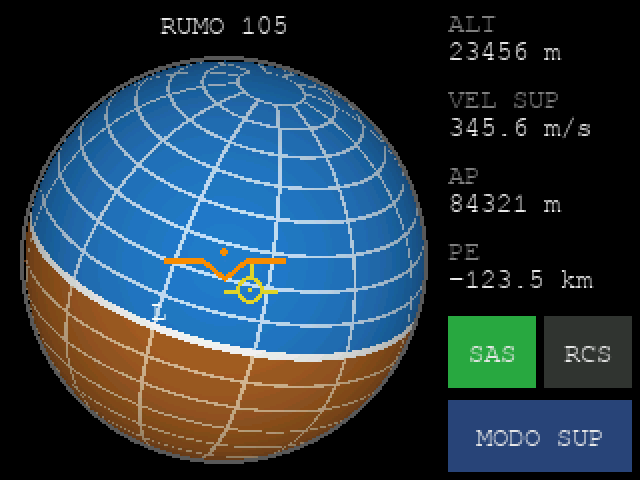

# Tela multifunção: simulador e navball

**Pronto quando:** a navball da janela acompanha a do jogo, os números batem com os do KSP e os botões de toque ligam e desligam o SAS e o RCS.

A mikromedia for ARM ainda não tem firmware: é a fase 6 do [roteiro](../README.md#fase-6--tela-multifunção-mikromedia-for-arm). Enquanto isso, a tela roda num **simulador**, uma janela de 320x240 no PC que fala exatamente o protocolo que a placa vai falar. A ponte (`mfd.py`) não sabe se do outro lado está o simulador ou a placa. Quando o firmware existir, basta trocar a janela pela porta serial, e o simulador vira a referência do que o firmware tem que desenhar.



## O que já se sabe da placa

- Ela tem **duas mini-USB**:
  - **USB** vai direto no LPC2148. Alimenta a placa e roda o demo de fábrica.
  - **PROG** tem um **FT232RL**, um conversor USB-serial. É por ela que o PC vai conversar com a placa, como uma porta COM comum, igual ao Mega. O firmware não precisa implementar USB.
- No primeiro teste, a PROG alimentou a placa, mas o Windows mostrou "Dispositivo USB desconhecido (falha na solicitação do descritor)". A suspeita é o cabo mini-USB, que é antigo e falha nos fios de dados.
  - Com um cabo bom, deve aparecer **USB Serial Port (COMx)** em *Portas (COM e LPT)*.
  - Se aparecer **FT232R USB UART** em *Outros dispositivos*, falta o driver VCP da FTDI (ftdichip.com → Drivers → VCP).
- **Ainda falta** o manual e o esquemático, no site da MikroE. Eles dizem qual é o controlador da tela, em que pinos estão a tela e o touch, e como gravar programas.

## Onde está o código

| Arquivo | O que é |
|---|---|
| [`bridge/mfd.py`](../bridge/mfd.py) | A ponte kRPC ⇄ tela: lê o jogo, manda as mensagens e executa os toques |
| [`bridge/mfd_simulador.py`](../bridge/mfd_simulador.py) | O simulador: faz o papel do firmware da mikromedia |
| [`bridge/navball.py`](../bridge/navball.py) | A conta da navball, escrita para ser passada para C |
| [`docs/protocolo.md`](protocolo.md#tela-multifunção-mikromedia) | O protocolo da tela, mensagem por mensagem |

## Instalar

No PC, além do que a ponte do painel já usa:

```
pip install krpc pyserial pygame numpy
```

## Testar sem o KSP

```
cd bridge
python mfd.py --demo
```

| Você faz | Resultado esperado |
|---|---|
| Roda o comando | A janela abre. A navball gira devagar, sobe, desce e rola, e os números mudam. O marcador amarelo (pró-grado) acompanha o nariz com um pouco de atraso. |
| Clica em **SAS** | O terminal mostra `SAS: ligar` e o botão fica verde. Outro clique apaga. |
| Clica em **RCS** | Igual ao SAS |
| Clica em **MODO** | `Modo da navball: ORB`: o botão e a `VEL` passam a mostrar `ORB`, e a velocidade muda |
| Clica fora dos botões | Nada acontece |
| Fecha a janela | O programa termina |

Janela pequena? `python mfd.py --demo --zoom 3`.

## Testar com o KSP

Com o jogo na cena de voo e o servidor kRPC iniciado:

```
cd bridge
python mfd.py
```

A ponte do painel (`ponte.py`) pode rodar ao mesmo tempo, em outro terminal: o kRPC aceita as duas conexões.

**Pronto quando:**

- [ ] Na plataforma, a navball da janela fica igual à do jogo: o centro no azul, olhando para cima.
- [ ] **Pitch** (W/S) e **yaw** (A/D): a navball da janela gira igual à do jogo, e o `RUMO` bate com o rumo do jogo.
- [ ] **Roll** (Q/E): a navball da janela gira igual à do jogo. Se girar **ao contrário**, troque `SINAL_ROLAGEM` para `-1` no começo do `mfd.py`. Não deu para confirmar o sinal sem o jogo.
- [ ] Depois de decolar, o pró-grado da janela fica no mesmo lugar que o do jogo.
- [ ] `ALT`, `VEL`, `AP` e `PE` batem com os do jogo. A velocidade no alto da navball do jogo troca sozinha de *Surface* para *Orbit* a partir de uma certa altitude; toque em **MODO** para comparar no mesmo modo. `AP` e `PE` ficam no mapa (tecla **M**).
- [ ] **SAS:** tocar o botão liga e desliga o SAS no jogo, e a tecla **T** muda a cor do botão.
- [ ] **RCS:** o mesmo, com a tecla **R**.
- [ ] Voltar ao KSC mostra `SEM SINAL`. Lançar outra nave faz a tela voltar sozinha.

## Problemas comuns

| Sintoma | Causa provável | Solução |
|---|---|---|
| `No module named 'pygame'` (ou `numpy`) | Faltou instalar | `pip install pygame numpy` |
| Fica parado em `Conectando ao kRPC...` | O jogo está esperando você aceitar a conexão | Aceitar na janela do kRPC, dentro do jogo |
| A navball rola ao contrário da do jogo | Sinal da rolagem do kRPC | `SINAL_ROLAGEM = -1` no `mfd.py` |
| Tocar em SAS não deixa o botão verde | A nave não tem SAS (sem piloto nem núcleo de sonda com SAS) | É o comportamento certo: o botão mostra o jogo |
| `SEM SINAL` com o foguete voando | A ponte parou, ou o terminal mostra `Nenhuma nave ativa` | Ver a mensagem no terminal |

## Como a navball é desenhada

A conta está em [`navball.py`](../bridge/navball.py), escrita para caber num ARM7 a 60 MHz sem ponto flutuante, e sem memória para guardar a tela inteira (320x240x2 = 150 KB contra 32 KB de RAM).

1. **Uma vez por quadro:** os três ângulos viram os eixos da nave no mundo (frente, direita e cima). São os únicos senos e cossenos do quadro, 6 consultas a uma tabela.
2. **Para cada ponto da bola:**
   - A posição (x, y) na bola tem uma altura z = √(1 − x² − y²), que depende só da posição e fica numa tabela.
   - A direção do mundo que o ponto mostra é `x·direita + y·cima + z·frente`: 9 multiplicações.
   - **Céu ou chão:** o sinal do componente vertical.
   - **Linhas de pitch:** a latitude é o arco-seno do componente vertical, lido de uma tabela.
   - **Meridianos:** o meridiano de cada rumo fica num plano vertical, e a distância do ponto ao plano sai de um produto escalar, sem arco-tangente. São 2 multiplicações por plano, com 6 planos.
   - **Sombra e cor:** escurece a borda e arredonda para 16 bits por ponto (RGB565).
3. **Marcadores e letras:** cada um é um vetor projetado na bola por 3 produtos escalares, e só aparece se estiver na metade visível.

São cerca de 31 mil pontos por quadro, cada um com umas 30 operações de inteiros. Na placa, a bola vai ser desenhada linha a linha, direto na memória do controlador da tela. Os números só são redesenhados quando mudam. A velocidade de verdade só dá para saber medindo na placa.

## Próximos passos

1. **Cabo mini-USB novo** para a PROG virar uma porta COM.
2. **Manual e esquemático** da mikromedia for ARM, no site da MikroE: controlador e pinos da tela e do touch, e como gravar. Pode ser pelo bootloader serial do LPC2148, pela PROG, com o Flash Magic ou o `lpc21isp`; ou pelo bootloader USB da MikroE, pela outra porta. **Antes de gravar qualquer coisa**, baixar o `.hex` do demo de fábrica, se estiver disponível: gravar um programa novo apaga o demo.
3. **Firmware, fase 6:** piscar um LED, depois a serial (eco, e em seguida este protocolo), depois a tela (pintar, texto), a navball e o touch. Quando a placa responder `READY`, rodar `python mfd.py --porta COMx`.
