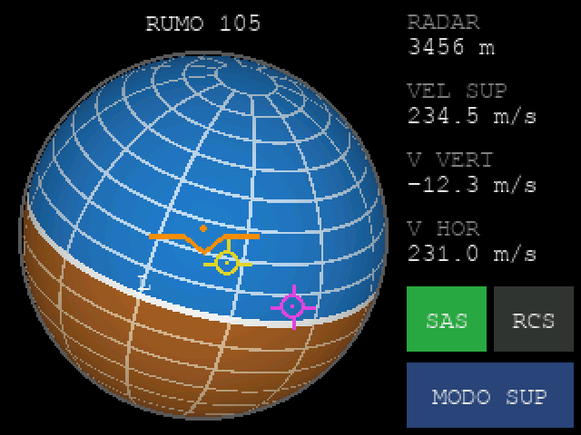
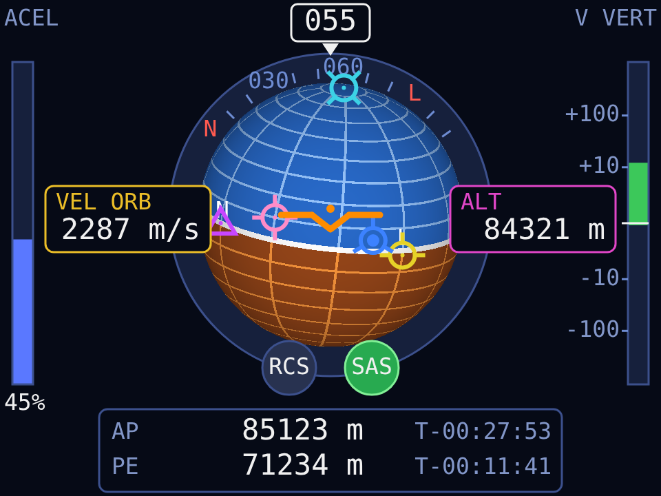

# Tela multifunção: navball, simulador e celular

**Pronto quando:** a navball da tela acompanha a do jogo, os números batem com os do KSP e os botões de toque ligam e desligam o SAS e o RCS.

A tela multifunção mostra uma navball no estilo do KSP2, velocidade, altitude, acelerador, velocidade vertical e os dados da órbita ou do alvo, com botões de toque. Ela vai morar na mikromedia for ARM, mas a placa ainda não tem firmware: é a fase 6 do [roteiro](../README.md#fase-6--tela-multifunção-mikromedia-for-arm). Enquanto isso, a mesma tela roda em dois lugares, e os três falam o mesmo [protocolo](protocolo.md#tela-multifunção-mikromedia):

```
 KSP + kRPC (PC)
      │ streams do kRPC
      ▼
 bridge/mfd.py: a ponte. Lê o jogo, escolhe o modo da navball,
      │         manda as mensagens e executa os toques
      │ protocolo em texto, uma mensagem por linha
      ├─────────────────────┬──────────────────────────┐
      ▼                     ▼                          ▼
 simulador             celular, pelo Wi-Fi         mikromedia, pela serial
 mfd_simulador.py      mfd_celular.py e            firmware/mfd/
 janela no PC          celular/index.html          (ainda não existe)
 (padrão)              (--celular)                 (--porta COMx)
```

A ponte não sabe qual tela está do outro lado. Quando o firmware existir, basta trocar a janela pela porta serial. O **simulador** desenha ponto a ponto na resolução da placa (320x240, 16 bits por ponto) e é a referência do que o firmware tem que desenhar. A **página do celular** segue as mesmas posições, só que na resolução do celular.

**Onde estamos:**

- Testado com o jogo: navball (pitch, yaw e roll), pró-grado, SAS e RCS pelo toque, e a volta automática ao trocar de nave. Estão marcados na lista de [Testar com o KSP](#testar-com-o-ksp).
- Ainda sem teste com o jogo: radar, troca automática de modo, modo ALVO, normal e radial, nó de manobra, acelerador, tempos até AP e PE, e os números na bola.
- Ainda sem teste num celular de verdade: a página foi testada num navegador simulando um celular.
- A placa ainda não conversa com o PC: o cabo mini-USB antigo falha nos dados (ver abaixo).



## O que já se sabe da placa

- Ela tem **duas mini-USB**:
  - **USB** vai direto no LPC2148. Alimenta a placa e roda o demo de fábrica.
  - **PROG** tem um **FT232RL**, um conversor USB-serial. É por ela que o PC vai conversar com a placa, como uma porta COM comum, igual ao Mega. O firmware não precisa implementar USB.
- No primeiro teste, a PROG alimentou a placa, mas o Windows mostrou "Dispositivo USB desconhecido (falha na solicitação do descritor)". A suspeita é o cabo mini-USB, que é antigo e falha nos fios de dados.
  - Com um cabo bom, deve aparecer **USB Serial Port (COMx)** em *Portas (COM e LPT)*.
  - Se aparecer **FT232R USB UART** em *Outros dispositivos*, falta o driver VCP da FTDI (ftdichip.com → Drivers → VCP).
- **Ainda falta** o manual e o esquemático, no site da MikroE. Eles dizem qual é o controlador da tela, em que pinos estão a tela e o touch, e como gravar programas.

## Onde está o código

| Arquivo | O que é |
|---|---|
| [`bridge/mfd.py`](../bridge/mfd.py) | A ponte kRPC ⇄ tela: lê o jogo, manda as mensagens e executa os toques |
| [`bridge/mfd_simulador.py`](../bridge/mfd_simulador.py) | O simulador: faz o papel do firmware da mikromedia |
| [`bridge/mfd_celular.py`](../bridge/mfd_celular.py) | O servidor da tela no celular: serve a página e troca as mensagens pelo Wi-Fi |
| [`bridge/celular/index.html`](../bridge/celular/index.html) | A página do celular: o "firmware" do navegador, com a mesma navball e o mesmo layout |
| [`bridge/navball.py`](../bridge/navball.py) | A conta da navball, escrita para ser passada para C |
| [`docs/protocolo.md`](protocolo.md#tela-multifunção-mikromedia) | O protocolo da tela, mensagem por mensagem |

## Instalar

No PC, além do que a ponte do painel já usa:

```
pip install krpc pyserial pygame-ce numpy
```

O **pygame-ce** é a versão do pygame mantida pela comunidade, e o código usa do mesmo jeito (`import pygame`). O pygame original não tem pacote para o Python 3.14. Não instale os dois juntos: se o pygame original já estiver instalado, rode `pip uninstall pygame` antes.

## O que a tela mostra

O layout se inspira na navball do KSP2: a bola no centro, cercada por um aro escuro.

- **Números na navball:** o rumo a cada 30°, logo acima do horizonte (N, 30, 60, L, 120...), e o pitch a cada 30° (60, 30, -30, -60), ao lado dos meridianos de N, L, S e O. Eles ficam sempre de pé, sem girar com a bola, e somem perto da borda.
- **Navball:** o "W" laranja no centro é para onde o nariz aponta. Os marcadores têm as cores do KSP, e cada um tem o seu oposto do outro lado da bola:

  | Cor | Marcador | Oposto |
  |---|---|---|
  | Amarelo | Pró-grado: para onde a nave vai | Retrógrado |
  | Roxo | Normal: perpendicular à órbita (numa órbita para leste, aponta para o norte) | Antinormal |
  | Ciano | Radial para fora: perpendicular ao movimento, do lado de fora do planeta | Radial para dentro |
  | Rosa | Alvo, quando há um alvo escolhido no jogo | Anti-alvo |
  | Azul | Nó de manobra: a direção da queima que falta | — |

- **Caixa amarela, à esquerda:** a velocidade, com o modo no título (`VEL SUP`, `VEL ORB` ou `VEL ALVO`). **Tocar nela troca o modo**, como no KSP2.
- **Caixa magenta, à direita:** `ALT`, acima do nível do mar. Abaixo de 5 km do chão vira `RADAR`, a altura acima do chão ou do mar; volta para `ALT` acima de 5,5 km.
- **Barra da esquerda:** o acelerador, de 0 a 100%.
- **Barra da direita:** a velocidade vertical, com o zero no meio e escala logarítmica (±10, ±100 e ±1000 m/s nas marcas e nas pontas). Verde subindo, amarela descendo devagar e vermelha descendo a mais de 10 m/s.
- **Botões redondos RCS e SAS**, embaixo da bola: verde quando o sistema está ligado **no jogo**. Tocar liga ou desliga.
- **Painel de baixo:** muda com o modo, e no `SUP` não aparece, porque a velocidade vertical já está na barra.

  | Modo | Velocidade, pró-grado, normal e radial em relação a | Painel de baixo |
  |---|---|---|
  | `SUP` | Superfície | — |
  | `ORB` | Órbita | `AP` e `PE`, com o tempo até cada um |
  | `ALVO` | Alvo (normal e radial não aparecem) | `DIST`, a distância até o alvo |

- **O modo troca sozinho, como no KSP:** vai para `ORB` acima de 36 km e volta para `SUP` abaixo de 33 km, em Kerbin. Em outros planetas, 6% e 5,5% do raio. Escolher ou trocar o alvo no jogo leva para `ALVO`, e tirar o alvo volta para `SUP` ou `ORB`. O toque na caixa da velocidade passa para o próximo modo; a escolha vale até a próxima troca automática.

## Testar sem o KSP

```
cd bridge
python mfd.py --demo
```

A nave de mentira desce até perto do chão e sobe até 55 km a cada 2 minutos. A cada minuto, ela ganha um alvo por 30 segundos, e a cada minuto e meio, um nó de manobra por 30 segundos.

| Você faz | Resultado esperado |
|---|---|
| Roda o comando | A janela abre. A navball gira devagar, sobe, desce e rola, com os números do rumo e do pitch andando junto, e os números das caixas e as barras mudam. |
| Espera | `ALT` vira `RADAR` perto do chão. O modo passa sozinho para `ORB` acima de 36 km e volta para `SUP` abaixo de 33 km, e o painel de baixo muda junto. Quando o alvo aparece, vai para `ALVO`, com `DIST` e os marcadores rosa; quando o alvo some, volta. O marcador azul da manobra aparece e some. O terminal mostra cada troca. |
| Clica em **SAS** | O terminal mostra `SAS: ligar` e o botão fica verde. Outro clique apaga. |
| Clica em **RCS** | Igual ao SAS |
| Clica na **caixa da velocidade** | Passa para o próximo modo. `ALVO` só entra na roda enquanto há alvo. |
| Clica fora dos botões | Nada acontece |
| Fecha a janela | O programa termina |

Janela pequena? `python mfd.py --demo --zoom 3`.

## No celular

O celular pode ser a tela, pelo Wi-Fi, sem instalar nada nele. A página desenha o mesmo layout da placa na resolução do celular, então tudo fica nítido.



1. No notebook, rode a ponte com `--celular`; com `--demo` também funciona:

   ```
   cd bridge
   python mfd.py --celular
   ```

   O terminal mostra o endereço, por exemplo `Abra no navegador do celular: http://192.168.0.15:8000`.

2. Na primeira vez, o Windows pergunta se o Python pode usar a rede. Marque **Redes privadas** e permita.
3. No celular, conectado **ao mesmo Wi-Fi**, abra esse endereço no navegador (Chrome no Android, Safari no iPhone) e deite o celular.
   - **Android:** o primeiro toque põe a página em tela cheia.
   - **iPhone:** Compartilhar → **Adicionar à Tela de Início**, e abra pelo ícone, que já fica sem a barra do navegador.
4. Aumente o tempo de bloqueio da tela do celular. Uma página comum, sem HTTPS, não consegue manter a tela acesa sozinha.

Outros detalhes:

- Pode abrir em mais de um aparelho ao mesmo tempo, inclusive no navegador do próprio notebook: todos mostram a mesma coisa e todos respondem ao toque.
- Qualquer pessoa no mesmo Wi-Fi pode abrir a página e tocar nos botões. Em casa não tem problema; em rede pública, não use.
- Se a conexão cair, a página reconecta sozinha e pede tudo de novo à ponte.
- A janela do simulador continua sendo a referência do que a placa vai mostrar, ponto por ponto. A página segue as mesmas posições, só que com mais detalhe.

**Pronto quando:**

- [ ] Com `python mfd.py --demo --celular`, a página abre no celular e a navball se mexe.
- [ ] Tocar em SAS deixa o botão verde e mostra `SAS: ligar` no terminal.
- [ ] O primeiro toque põe a página em tela cheia (Android), ou ela abre sem a barra pelo ícone da Tela de Início (iPhone).
- [ ] Desligar o Wi-Fi do celular por alguns segundos mostra `SEM SINAL`; ao religar, a tela volta sozinha.
- [ ] Com o KSP, os mesmos itens de [Testar com o KSP](#testar-com-o-ksp) valem no celular.

## Testar com o KSP

Com o jogo na cena de voo e o servidor kRPC iniciado:

```
cd bridge
python mfd.py
```

A ponte do painel (`ponte.py`) pode rodar ao mesmo tempo, em outro terminal: o kRPC aceita as duas conexões.

**Pronto quando:**

- [x] Na plataforma, a navball da janela fica igual à do jogo: o centro no azul, olhando para cima.
- [x] **Pitch** (W/S), **yaw** (A/D) e **roll** (Q/E): a navball da janela gira igual à do jogo.
- [x] O pró-grado da janela fica no mesmo lugar que o do jogo.
- [x] **SAS** e **RCS:** tocar o botão liga e desliga no jogo, e as teclas **T** e **R** mudam a cor do botão.
- [x] Voltar ao KSC mostra `SEM SINAL`. Lançar outra nave faz a tela voltar sozinha.
- [ ] Na plataforma e no pouso, a tela mostra `RADAR`, igual ao altímetro do jogo no modo radar. Acima de 5,5 km volta para `ALT`.
- [ ] Na subida, o modo passa sozinho para `ORB` perto dos 36 km, junto com a navball do jogo. Na descida, volta para `SUP` perto dos 33 km. `AP` e `PE` só aparecem em `ORB` e batem com o mapa (tecla **M**).
- [ ] Em `SUP`, `V VERT` fica negativa descendo e positiva subindo.
- [ ] **Alvo:** escolher uma nave ou um planeta como alvo leva a tela para `ALVO`. Os marcadores rosa ficam no mesmo lugar que os do jogo, e `VEL` e `DIST` batem com os do jogo no modo *Target*. Tirar o alvo volta para `SUP` ou `ORB`.
- [ ] **MODO:** tocar na caixa da velocidade passa por `SUP`, `ORB` e `ALVO` (só com alvo).
- [ ] Em órbita, os marcadores **normal** e **radial** ficam no mesmo lugar que os do jogo: aponte a nave para o normal (SAS em *Normal*) e o triângulo roxo deve ficar no centro.
- [ ] Com um **nó de manobra**, o marcador azul fica no mesmo lugar que o do jogo e some quando a queima termina.
- [ ] A barra do **acelerador** acompanha as teclas **Shift** e **Ctrl** (e **Z** e **X**).
- [ ] A barra da **velocidade vertical** fica verde na subida e amarela ou vermelha na descida.
- [ ] O tempo até o `AP` e o `PE` bate com o do mapa.
- [ ] Os **números na navball** (rumo e pitch) ficam nos mesmos lugares que os da navball do jogo.

## Problemas comuns

| Sintoma | Causa provável | Solução |
|---|---|---|
| `No module named 'pygame'` (ou `numpy`) | Faltou instalar | `pip install pygame-ce numpy` |
| O `pip install pygame` falha dizendo que não há versão para o Python 3.14 | O pygame original parou no Python 3.13 | Instalar o `pygame-ce` no lugar |
| Fica parado em `Conectando ao kRPC...` | O jogo está esperando você aceitar a conexão | Aceitar na janela do kRPC, dentro do jogo |
| Tocar em SAS não deixa o botão verde | A nave não tem SAS (sem piloto nem núcleo de sonda com SAS) | É o comportamento certo: o botão mostra o jogo |
| `SEM SINAL` com o foguete voando | A ponte parou, ou o terminal mostra `Nenhuma nave ativa` | Ver a mensagem no terminal |
| O celular não abre a página | Celular noutra rede (dados móveis, Wi-Fi de visitantes), firewall do Windows, ou rede do Windows como Pública | Mesmo Wi-Fi; permitir o Python em *Redes privadas*; rede do Windows como Privada, como na fase 0 |
| O endereço mostrado não funciona, e o notebook tem mais de uma rede (cabo e Wi-Fi, VPN) | O IP mostrado é o da outra rede | Ver o IP do Wi-Fi com `ipconfig` e usar esse, com `:8000` no fim |
| `Não foi possível abrir a porta 8000 para o celular` | Outro programa já usa a porta | `python mfd.py --celular 8080` e abrir com `:8080` no fim |
| `DIST`, `AP` ou `PE` mostram `---` longe de casa | A distância passou de 2,1 milhões de km, o limite de um inteiro de 32 bits | Normal com planetas distantes |

## Como o código funciona por dentro

A cada volta do laço principal (`voar()` no `mfd.py`, a cada ~10 ms):

1. **A fonte lê o jogo** e devolve uma `Telemetria`: atitude, velocidades nos três modos, altitude e radar, posição, órbita, acelerador, alvo, nó de manobra e o estado do SAS e do RCS. A fonte é a `NaveKrpc` (streams do kRPC) ou a `Demo` (a nave de mentira).
2. **As linhas da tela são tratadas:** `READY` faz a ponte reenviar tudo; `TOQUE SAS` e `TOQUE RCS` invertem o sistema no jogo; `TOQUE MODO` passa para o próximo modo.
3. **O `ModoNavball` escolhe o modo** (`SUP`, `ORB` ou `ALVO`), com as trocas automáticas pela altitude e pelo alvo.
4. **O `Transmissor` decide o que mandar e quando:**

   | O quê | Frequência |
   |---|---|
   | `MODO`, `SAS` e `RCS` | Quando mudam, e todos 1 vez por segundo. O `MODO` vai antes dos números |
   | `ATT` | 20 por segundo |
   | Marcadores: `PRO`, `NRM`, `RDL`, `TGT` e `MNV` | 10 por segundo |
   | Números: `ALT` ou `RAD`, `VEL`, `VV`, `ACEL` e `DIST` | 10 por segundo |
   | Órbita: `AP`, `PE`, `TAP` e `TPE`, só no modo `ORB` | 2 por segundo |

As peças:

| Peça | Arquivo | Papel |
|---|---|---|
| `NaveKrpc` e `Demo` | `mfd.py` | Fontes de dados: o jogo, pelo kRPC, ou uma nave de mentira |
| `Telemetria` | `mfd.py` | Tudo o que a ponte precisa saber da nave numa volta do laço |
| `ModoNavball` | `mfd.py` | O modo da navball e as trocas automáticas |
| `Transmissor` | `mfd.py` | Transforma a telemetria em mensagens, cada uma na sua frequência |
| `Simulador` | `mfd_simulador.py` | Tela: janela no PC, na resolução da placa |
| `TelaCelular` | `mfd_celular.py` | Tela: servidor HTTP que liga a ponte à página do celular |
| página | `celular/index.html` | O "firmware" do navegador: interpreta o protocolo e desenha |
| `Painel` | `ponte.py` | Tela: a serial, para a mikromedia quando o firmware existir |
| funções da navball | `navball.py` | A conta da bola, usada pelo simulador e copiada no JavaScript |

Toda tela tem a mesma interface: `enviar(linha)` manda uma linha para a tela, `linhas()` devolve as linhas que a tela mandou, e ainda `esperar_ready()` e `fechar()`.

**Referenciais.** As velocidades e direções saem do kRPC já nos eixos do horizonte local da nave (cima, norte, leste), por referenciais "híbridos": posição e velocidade medidas em relação ao planeta, mas com os eixos da superfície. Em relação ao chão, que gira, no modo `SUP`; em relação ao centro do planeta, sem girar, no `ORB`. A velocidade relativa ao alvo é a diferença entre a velocidade orbital da nave e a do alvo, as duas no mesmo referencial.

### Acrescentar um número ou um marcador

1. **`Telemetria`:** um campo novo, preenchido pela `NaveKrpc.ler()` (um stream novo no `__init__`) e pela `Demo.ler()`.
2. **`Transmissor.enviar()`:** a mensagem nova, na frequência certa. Para um marcador, use `mensagem_direcao()` com um vetor (cima, norte, leste).
3. **`docs/protocolo.md`:** uma linha na tabela.
4. **`mfd_simulador.py`:** aceitar a mensagem em `_interpretar()` e desenhar. Um marcador também entra em `_marcadores` e em `pares`, com a função que o desenha.
5. **`celular/index.html`:** o mesmo, em `interpretar()` e no desenho, nas mesmas posições.

Depois, confira com `python mfd.py --demo`, na janela e com `--celular`.

### Armadilhas

- **O layout está em dois lugares:** `mfd_simulador.py` e `celular/index.html`, e as cores e larguras da navball também estão em `navball.py`. Mudou um, mude o outro. O simulador é a referência da placa.
- **Linhas de no máximo 31 caracteres.** Um texto livre, como o nome de um alvo, teria que ser cortado antes de ir para a tela.
- **Os referenciais do kRPC são "canhotos"** (eixos da mão esquerda). O produto vetorial só dá o sentido certo em eixos da mão direita, então `normal_e_radial()` troca a ordem para (leste, norte, cima) antes da conta.
- **No navegador, os pedidos HTTP podem chegar fora de ordem.** A página manda uma linha de cada vez, esperando a anterior terminar, para funcionar como uma serial.
- **Página sem HTTPS:** o navegador não deixa manter a tela do celular acesa, e o iPhone não deixa pôr uma página em tela cheia (só pelo ícone da Tela de Início).
- **pygame no Python 3.14:** só o `pygame-ce` tem pacote; os dois não podem ser instalados juntos.

## Como a navball é desenhada

A conta está em [`navball.py`](../bridge/navball.py), escrita para caber num ARM7 a 60 MHz sem ponto flutuante, e sem memória para guardar a tela inteira (320x240x2 = 150 KB contra 32 KB de RAM).

1. **Uma vez por quadro:** os três ângulos viram os eixos da nave no mundo (frente, direita e cima). São os únicos senos e cossenos do quadro, 6 consultas a uma tabela.
2. **Para cada ponto da bola:**
   - A posição (x, y) na bola tem uma altura z = √(1 − x² − y²), que depende só da posição e fica numa tabela.
   - A direção do mundo que o ponto mostra é `x·direita + y·cima + z·frente`: 9 multiplicações.
   - **Céu ou chão:** o sinal do componente vertical.
   - **Linhas de pitch:** a latitude é o arco-seno do componente vertical, lido de uma tabela.
   - **Meridianos:** o meridiano de cada rumo fica num plano vertical, e a distância do ponto ao plano sai de um produto escalar, sem arco-tangente. São 2 multiplicações por plano, com 6 planos.
   - **Sombra e cor:** escurece a borda e arredonda para 16 bits por ponto (RGB565).
3. **Marcadores e números:** cada um é um vetor projetado na bola por 3 produtos escalares, e só aparece se estiver na metade visível. As direções dos marcadores chegam prontas da ponte: normal e radial saem de produtos vetoriais da posição e da velocidade, feitos no PC. Os números do rumo e do pitch são escritos de pé no ponto projetado, com a fonte normal e uma sombra escura, então a placa não precisa girar texto.

Com raio de 72 pontos, são cerca de 16 mil pontos por quadro, cada um com umas 30 operações de inteiros. Na placa, a bola vai ser desenhada linha a linha, direto na memória do controlador da tela. Os números só são redesenhados quando mudam. A velocidade de verdade só dá para saber medindo na placa.

## Próximos passos

1. **Cabo mini-USB novo** para a PROG virar uma porta COM.
2. **Manual e esquemático** da mikromedia for ARM, no site da MikroE: controlador e pinos da tela e do touch, e como gravar. Pode ser pelo bootloader serial do LPC2148, pela PROG, com o Flash Magic ou o `lpc21isp`; ou pelo bootloader USB da MikroE, pela outra porta. **Antes de gravar qualquer coisa**, baixar o `.hex` do demo de fábrica, se estiver disponível: gravar um programa novo apaga o demo.
3. **Firmware, fase 6:** piscar um LED, depois a serial (eco, e em seguida este protocolo), depois a tela (pintar, texto), a navball e o touch. Quando a placa responder `READY`, rodar `python mfd.py --porta COMx`.
4. **Manobras pela tela** (ideia para depois): informações do próximo nó (Δv, tempo de queima, T− até o nó) e um editor de manobras pelo toque, junto com o editor de encoders da fase 4.
5. **Roda de modos do SAS** (ideia para depois): uma segunda página com botões grandes para estabilidade, pró e retrógrado, normal, radial, alvo e manobra.

## Histórico

A tela foi feita aos poucos, testando no jogo entre uma etapa e outra:

| PR | O que entrou |
|---|---|
| [#10](https://github.com/Schackschuck/KSP/pull/10) | Descoberta das duas USB da placa (a PROG tem um FT232RL); o simulador de 320x240, a ponte com o kRPC, o modo `--demo` e a navball 3D feita só com multiplicações e somas |
| [#11](https://github.com/Schackschuck/KSP/pull/11) | Instalação com o `pygame-ce`, porque o pygame não tem pacote para o Python 3.14 |
| [#12](https://github.com/Schackschuck/KSP/pull/12) | Altitude pelo radar perto do chão, troca automática SUP ⇄ ORB como no KSP, e o modo ALVO |
| [#13](https://github.com/Schackschuck/KSP/pull/13) | Marcadores normal, radial e de manobra; visual inspirado no KSP2, com barras do acelerador e da velocidade vertical e botões redondos |
| [#14](https://github.com/Schackschuck/KSP/pull/14) | A tela no celular, pelo Wi-Fi |
| [#15](https://github.com/Schackschuck/KSP/pull/15) | Números do rumo e do pitch na própria navball; sai a fita de rumo, e o modo SUP fica sem o painel de baixo |
