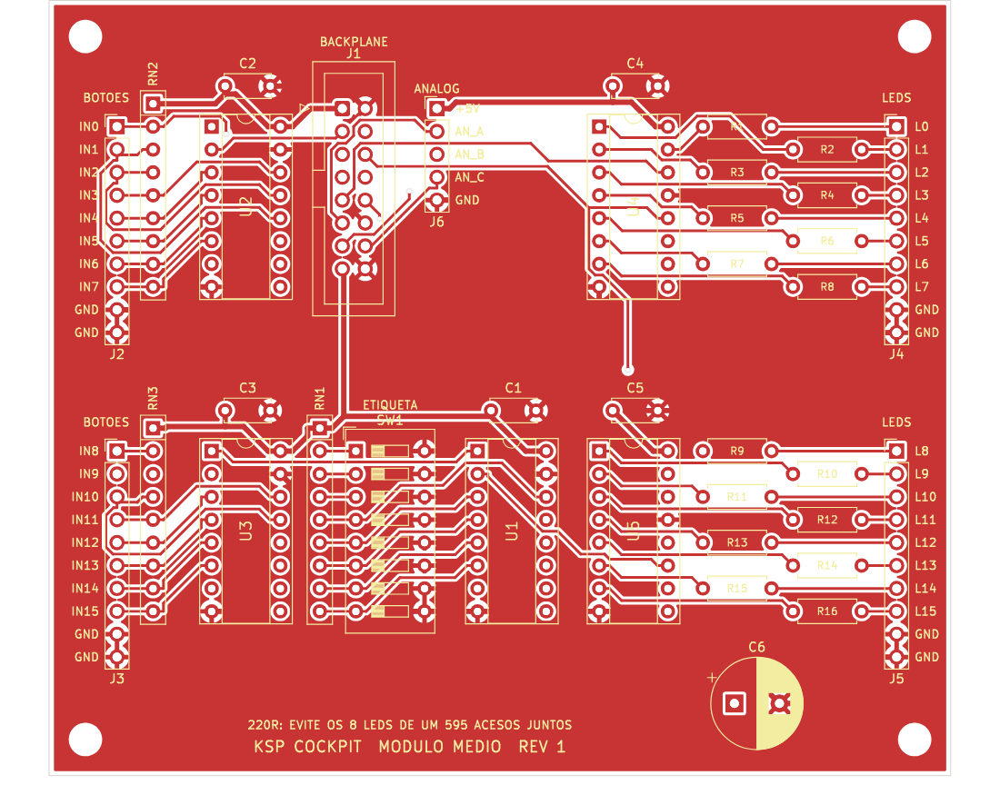

# Hardware

Esquemáticos do painel, feitos no KiCad. Cada pasta tem também um PDF do esquema, que dá para ver sem instalar nada.

| Pasta | Placa | CIs |
|---|---|---|
| [`modulo_pequeno/`](modulo_pequeno/) | Módulo pequeno: 8 entradas e 8 LEDs ([PDF](modulo_pequeno/modulo_pequeno.pdf)) | etiqueta + 1 × 74HC165, 1 × 74HC595 |
| [`modulo_medio/`](modulo_medio/) | Módulo médio: 16 entradas e 24 LEDs, com 12 jacks de korry ([PDF](modulo_medio/modulo_medio.pdf), [PCB](#pcb-do-módulo-médio)) | etiqueta + 2 × 74HC165, 3 × 74HC595 |
| [`modulo_grande/`](modulo_grande/) | Módulo grande: 24 entradas e 32 LEDs ([PDF](modulo_grande/modulo_grande.pdf)) | etiqueta + 3 × 74HC165, 4 × 74HC595 (o esquema ainda tem 2: ver [Próximos passos](#próximos-passos)) |
| [`backplane/`](backplane/) | Backplane: liga até 12 módulos ao Mega ([PDF](backplane/backplane.pdf)) | — |

A parte física (carcaça, aparência, os painéis da versão B e o sidestick) está em [construcao.md](construcao.md). Peças feitas em casa e usadas em vários painéis têm pasta própria, com a ficha e os desenhos: [`korry/`](korry/README.md). A [identidade visual](identidade_visual.md) diz como todo painel tem que parecer, e os desenhos dos painéis são gerados por código em [`desenho/`](desenho/README.md).

As três placas de módulo usam o mesmo cabo flat e encaixam em qualquer slot. Cada uma tem uma **etiqueta**, um 74HC165 a mais ligado a uma chave DIP de 8 vias: é por ela que o Mega descobre sozinho qual módulo está em cada slot.

## Como abrir

1. Instale o KiCad 7 ou mais novo e abra o `.kicad_pro` de cada pasta.
2. Os arquivos estão no formato do KiCad 7. Uma versão mais nova avisa que vai converter o arquivo ao salvar: pode aceitar.
3. Os símbolos estão embutidos no esquema. As footprints já estão escolhidas (DIP-16 com soquete, IDC 2x8, chave DIP, barras de pinos). O módulo médio já tem a PCB pronta para fabricar ([abaixo](#pcb-do-módulo-médio)); as outras placas ficam para a fase 7.
4. Ao abrir, rode o verificador de regras elétricas: menu **Inspecionar → Verificador de Regras Elétricas (ERC)**.

## Como tudo se liga

```
Mega ──(7 fios)── Backplane ── slot 1 ──(cabo flat)── módulo
                            ├─ slot 2 ──(cabo flat)── módulo
                            └─ ... até o slot 12
```

- **O Mega nunca liga direto nos módulos,** só no backplane: 5 sinais, +5V e GND.
- **Os pinos do Mega não aumentam com o número de módulos.** Os sinais seguem de módulo em módulo, numa fila.
- **As entradas de todos os módulos formam uma única cadeia de 74HC165,** que termina no MISO do Mega.
- **As saídas formam uma única cadeia de 74HC595,** que começa no MOSI.
- **Só os módulos com joystick ou acelerador** precisam de mais fios até o Mega: 3 analógicos por slot.

### Cabo flat (IDC 2x8, igual no módulo e no slot)

| Pino | Sinal | Pino | Sinal |
|---|---|---|---|
| 1 | +5V | 2 | GND |
| 3 | SCK | 4 | GND |
| 5 | PL (carrega as entradas) | 6 | RCLK (atualiza os LEDs) |
| 7 | SIN165 (vem do slot seguinte) | 8 | SOUT165 (vai para o Mega) |
| 9 | SIN595 (vem do Mega) | 10 | SOUT595 (vai para o slot seguinte) |
| 11 | AN_A | 12 | GND |
| 13 | AN_B | 14 | AN_C |
| 15 | +5V | 16 | GND |

### Ligação ao Mega

| Sinal | Pino do Mega | Observação |
|---|---|---|
| SCK | D52 | SPI |
| MOSI | D51 | Entra na cadeia de 74HC595 |
| MISO | D50 | Sai da cadeia de 74HC165 |
| PL | D49 | |
| RCLK | D48 | |
| Analógicos dos slots 1 a 5 | A0 a A14 | Slot k: A(3k−3), A(3k−2), A(3k−1) |
| 5V | 5V | Só com JP1 em 1-2 |
| GND | GND | Sempre ligado, mesmo com fonte externa |

Não use o D53 (SS) como entrada: se ele for a 0, o SPI do Mega sai do modo mestre. O `SPI.begin()` já o deixa como saída.

### Regras do backplane

1. **Módulos em slots seguidos,** a partir do slot 1, sem buracos. O Mega para de ler no primeiro slot vazio.
2. **A ordem dos módulos não importa:** cada um se identifica pela etiqueta.
3. **Módulos com joystick ou acelerador vão nos slots 1 a 5,** os únicos com linhas analógicas.
4. **JP1 escolhe de onde vem o +5V dos módulos:**
   - **1-2:** 5 V do Mega. Serve para poucos módulos, com o Mega alimentado pela USB.
   - **2-3:** fonte externa de 5 V no borne J3. É para o painel completo.
   - Use um jumper só: ele liga 1-2 ou 2-3, nunca as duas fontes juntas.
5. **Encaixe e tire módulos com o painel desligado.** O conector do cabo flat não garante que o GND encosta antes dos sinais. Ao ligar, o Mega reconhece sozinho o que estiver encaixado.

## Primeiro teste: um módulo direto no Mega

Dá para testar um módulo antes de montar o backplane, ligando o conector J1 do módulo direto no Mega com 8 jumpers:

| J1 do módulo | Mega |
|---|---|
| 1 (+5V) | 5V |
| 2 (GND) | GND |
| 3 (SCK) | D52 |
| 5 (PL) | D49 |
| 6 (RCLK) | D48 |
| 8 (SOUT165) | D50 (MISO) |
| 9 (SIN595) | D51 (MOSI) |
| 7 (SIN165) | GND: marca o fim da fila, como faria um slot vazio |

Os pinos 4, 12 e 16 são GND repetidos, e 15 é +5V repetido: com um cabo curto não precisam de fio. O 10 (SOUT595) fica solto. Os analógicos (11, 13 e 14) vão em A0, A1 e A2, se o módulo tiver joystick.

## Etiqueta: como o Mega reconhece cada módulo

A etiqueta é o primeiro byte que o Mega lê de cada módulo.

**O byte da etiqueta:**
- Cada chave DIP ligada (ON) põe o bit correspondente em 1. A chave k é o bit k−1.
- O Mega inverte o byte lido, porque a chave liga a entrada ao GND.
- **Bits 7 e 6 = tamanho da placa:** 01 pequena, 10 média, 11 grande. É por eles que o Mega sabe quantos bytes vêm depois.
- **Bits 5 a 0 = número da seção:** de 1 a 62, e diz qual módulo é.

**Valores reservados:**
- **Tudo ligado (byte 0xFF depois de inverter):** é o que o Mega lê num slot vazio, graças aos pull-downs do backplane. Quer dizer "acabou a fila".
- **Tudo desligado (0x00):** etiqueta esquecida; o Mega avisa em vez de adivinhar.

**Como o Mega lê a fila:**
1. Lê a etiqueta do slot 1.
2. Pelo tamanho, sabe quantos bytes de entrada pular: 1, 2 ou 3.
3. Lê a etiqueta do slot 2, e assim por diante, até achar a marca de fim.

Assim, não existe tabela de slots no firmware. O Mega avisa a ponte qual módulo está em cada slot, e a ponte sabe o que cada entrada e cada LED daquele módulo faz no jogo.

### Qual placa e qual etiqueta em cada seção

| Seção do painel | Entradas | LEDs | Placa | Número | Chaves DIP em ON |
|---|---|---|---|---|---|
| [Ação executiva](construcao.md#ação-executiva) (STAGE, ABORT e os 6 scripts) | 8 | 14 | média | 1 | 1, 8 |
| [Tempo](construcao.md#tempo) | 9 | 1 | média | 2 | 2, 8 |
| [Sidestick](construcao.md#sidestick) (3 eixos analógicos) | 1 | 3 | pequena, slots 1 a 5 | 3 | 1, 2, 7 |
| [Tela multifunção](construcao.md#tela-multifunção) (páginas e SILENCIAR) | 5 | 0 | pequena | 4 | 3, 7 |
| [Acelerador](construcao.md#acelerador) (alavanca analógica, trem, freios e luzes) | 3 | 3 | pequena, slots 1 a 5 | 5 | 1, 3, 7 |
| [Recursos e EVA](construcao.md#recursos-e-eva) | 6 | 2 | pequena | 6 | 2, 3, 7 |
| [Voo](construcao.md#painel-de-sistemas-de-controle) (sistemas de controle: SAS, RCS, FBW e piloto automático) | 17 | 31 | grande | 7 | 1, 2, 3, 7, 8 |
| [Action groups](construcao.md#action-groups) (1 a 10 e as peças) | 14 | 4 | média | 8 | 4, 8 |
| [Câmera](construcao.md#câmera) | 5 | 2 | pequena | 9 | 1, 4, 7 |
| [Navegação](construcao.md#navegação) | 10 | 0 | média | 10 | 2, 4, 8 |
| [Editor de manobras](construcao.md#painel-do-editor-de-manobras) | 16 | 3 | média | 12 | 3, 4, 8 |

São 11 módulos da [versão B do cockpit](construcao.md#cockpit-versão-b): 5 pequenos, 5 médios e 1 grande, e sobra 1 slot. O sidestick e o acelerador vão nos slots 1 a 5, os únicos com linhas analógicas: o sidestick usa as três (X, Y e torção), o acelerador uma. As 4 barras de recursos e a da EVA (50 LEDs) não passam pelo backplane: um MAX7219 ligado direto em 3 pinos do Mega acende todas. As seções da mesma placa podem ficar longe uma da outra no painel: os fios dos botões até a placa podem ter uns 30 cm.

Os números 3, 4, 6, 9 e 11 mudaram de seção com a versão B: antes eram os analógicos de rotação e translação, a telemetria, a EVA e a câmera. O firmware ainda não lê as etiquetas, então nada no código muda.

## No módulo

| O que liga | Pequeno | Médio | Grande | Como |
|---|---|---|---|---|
| Etiqueta | SW1 | SW1 | SW1 | Chave DIP de 8 vias, conforme a tabela acima. |
| Botões e chaves | J2 (IN0–IN7) | K1–K12 (IN0–IN11) e J2 (IN12–IN15) | J2, J3, J4 (IN0–IN23) | Entre o INn e o GND do próprio conector. Apertado ou ligado lê **0** (pull-up de 10 kΩ). |
| LEDs | J3 (LED0–LED7) | K1–K12 (LED0–LED23) | J5, J6 (LED0–LED15) e, quando o esquema tiver os 4 × 74HC595, mais dois conectores (LED16–LED31) | Anodo no LEDn, catodo no GND. O resistor já está na placa. Na pequena e na grande é de 1 kΩ: uns 3 mA por LED, e os 8 LEDs de um 74HC595 ficam abaixo de 70 mA. Na média é de 220 Ω, que acende mais forte: uns 13 mA por LED, e os 8 de um 74HC595 acesos juntos passam dos 70 mA do CI. |
| Joystick ou acelerador | J4 | J6 | J7 | Pontas do potenciômetro em +5V e GND, cursor em AN_A, AN_B ou AN_C. |

**Os LEDs mostram o estado do jogo.** Nenhum LED é ligado a um botão: o Mega acende cada LED com o que a ponte manda do kRPC. Até o LED de um botão iluminado vai numa saída LEDn, separado do contato do botão.

**Botão com LED de 5 V** (como os botões arcade) já tem resistor interno. Com o resistor da placa em série, ele fica mais fraco. Se ficar fraco demais, troque o resistor daquela saída por um de menor valor, ou por um fio.

## Ordem dos bytes (para o firmware)

| Placa | Bytes de entrada, na ordem de leitura | Bytes de saída |
|---|---|---|
| Pequena | 2: U1 (etiqueta), U2 (IN0–IN7) | 1: U3 (LED0–LED7) |
| Média | 3: U1 (etiqueta), U2 (IN0–IN7), U3 (IN8–IN15) | 3: U4 (LED0–LED7), U5 (LED8–LED15), U6 (LED16–LED23) |
| Grande | 4: U1 (etiqueta), U2 (IN0–IN7), U3 (IN8–IN15), U4 (IN16–IN23) | 4: U5 (LED0–LED7), U6 (LED8–LED15), U7 (LED16–LED23), U8 (LED24–LED31) |

**Entradas:**
1. Um pulso baixo em PL copia todas as entradas, e as etiquetas, para os 74HC165.
2. Em seguida, o SPI lê os bytes a começar pelo slot 1. Em cada byte de entrada, o bit n é o INn do respectivo CI.

**Saídas:**
1. O SPI envia os bytes de saída **do último slot para o primeiro**, e em cada slot do último CI para o primeiro. O último byte enviado fica no primeiro 74HC595 do slot 1.
2. Um pulso em RCLK acende o que foi enviado.

**Uma varredura em uma transferência só:**
- Como as duas cadeias compartilham o SCK, dá para ler e escrever junto.
- Cada placa tem pelo menos tantos bytes de entrada quanto de saída. Então, depois de conhecer os módulos na partida, basta transferir o total de bytes de entrada, com os bytes de saída no fim.
- Com as 12 placas da tabela, são 31 bytes: uns 125 µs a 2 MHz.
- Feito mil vezes por segundo numa interrupção de timer, dá tempo de ler até os encoders.
- Um byte a mais no fim confere a marca de fim da fila.

## Lista de peças por placa

**Módulo pequeno:**
- U1 (etiqueta) e U2: 74HC165.
- U3: 74HC595.
- RN1–RN2: rede resistiva 10 kΩ SIP 9 pinos.
- SW1: chave DIP de 8 vias.
- R1–R8: 1 kΩ.
- C1–C3: 100 nF.
- C4: 10 µF.
- J1: conector IDC 2x8 macho com trava.
- J2–J3: barra de pinos 1x10.
- J4: barra de pinos 1x5.
- 3 soquetes DIP-16.

**Módulo médio:**
- U1 (etiqueta), U2 e U3: 74HC165.
- U4–U6: 74HC595.
- RN1–RN3: rede resistiva 10 kΩ SIP 9 pinos.
- SW1: chave DIP de 8 vias.
- R1–R24: 220 Ω, 1/4 W.
- C1–C5 e C7: 100 nF.
- C6: 470 µF eletrolítico, de 10 V ou mais e até 10 mm de diâmetro.
- J1: conector IDC 2x8 macho com trava.
- K1–K12: conector JST-XH de 4 vias, macho de placa, vertical (B4B-XH-A).
- J2 e J6: barra de pinos 1x5.
- 6 soquetes DIP-16.

**Módulo grande:**
- U1 (etiqueta) a U4: 74HC165.
- U5–U8: 74HC595 (o esquema ainda tem só U5 e U6).
- RN1–RN4: rede resistiva 10 kΩ SIP 9 pinos.
- SW1: chave DIP de 8 vias.
- R1–R32: 1 kΩ.
- C1–C8: 100 nF.
- C9: 10 µF.
- J1: conector IDC 2x8 macho com trava.
- J2–J6: barra de pinos 1x10.
- J7: barra de pinos 1x5.
- 8 soquetes DIP-16.

**Backplane:**
- J1: barra de pinos 1x7.
- J2: barra de pinos 1x16.
- J3: borne de 2 vias.
- JP1: barra de pinos 1x3 com jumper.
- J10–J21: conector IDC 2x8 macho.
- R1–R5: 47 Ω.
- R10–R22: 10 kΩ.
- C1: 470 µF.
- C2: 100 nF.

## PCB do módulo médio

A placa do módulo médio está desenhada e pronta para mandar fabricar. Ela tem um jack para cada [korry](korry/README.md), com o botão e os dois LEDs, e uma barra (J2) com as 4 entradas que sobram, para botões comuns.

| Jack | Pino 1 | Pino 2 | Pino 3 | Pino 4 |
|---|---|---|---|---|
| Kk (k de 1 a 12) | GND | IN(k−1): botão | LED(2k−2): LED de cima | LED(2k−1): LED de baixo |

Por exemplo, o K1 usa IN0, LED0 e LED1, e o K12 usa IN11, LED22 e LED23. Um korry de legenda única acesa usa só o pino 3.



| O quê | Como é |
|---|---|
| Tamanho | 100 × 100 mm, com 4 furos M3 nos cantos (centro a 3,5 mm das bordas), para prender atrás do painel com espaçadores |
| Camadas | 2, com o GND preenchido nas duas faces |
| Trilhas | 0,3 mm nos sinais e 0,6 mm no +5V e no GND |
| Peças | As da [lista acima](#lista-de-peças-por-placa), todas de furo passante |
| Korry | 12 jacks JST-XH de 4 vias, K1 a K6 na borda de cima e K7 a K12 na de baixo |
| Verificação | DRC do KiCad sem nenhum erro e sem nenhuma ligação faltando |

Os arquivos ficam em [`modulo_medio/`](modulo_medio/): a placa (`modulo_medio.kicad_pcb`), as regras do DRC (`modulo_medio.kicad_dru`) e, em `fabricacao/`, o `modulo_medio_gerbers.zip` com os Gerbers e a furação.

### Como encomendar

1. No site da fábrica (JLCPCB, PCBWay ou outra), enviar o `fabricacao/modulo_medio_gerbers.zip`. O site lê o tamanho sozinho.
2. Escolher 2 camadas, espessura de 1,6 mm e acabamento HASL. A cor não importa. A quantidade mínima costuma ser 5 placas, e as 6 médias do painel cabem em 10.
3. O resto pode ficar no padrão.

### Na hora de montar

- A face de cima tem os nomes das peças, a ordem dos pinos dos jacks (`1 GND  2 BOTAO  3 LED CIMA  4 LED BAIXO`) e os pinos das barras J2 e J6.
- Os pinos 1 têm ilha quadrada. No J1, o pino 1 também tem um triângulo, e ele é o +5V.
- Nas redes RN1 a RN3, o pino comum (marcado com um ponto na peça) vai na ilha quadrada, que é o +5V.
- Os soquetes vão com o chanfro para cima, do lado do pino 1.
- O C6 tem polaridade: a perna mais comprida (+) vai na ilha quadrada.

### Gerar de novo

A placa é gerada por [`pcb/modulo_medio.py`](pcb/modulo_medio.py), a partir do esquema:

1. lê as ligações do `modulo_medio.kicad_sch`;
2. posiciona as peças;
3. roteia com o [Freerouting](https://github.com/freerouting/freerouting);
4. preenche o GND;
5. roda o DRC e refaz os Gerbers.

Mudou o esquema? Basta rodar de novo:

```
python3 hardware/pcb/modulo_medio.py
```

**O que precisa estar instalado:**
- o KiCad 7, com o módulo `pcbnew` do Python;
- o Java 21;
- o jar do Freerouting 1.9, apontado pela variável `FREEROUTING_JAR`;
- o `xvfb-run`, se o computador não tiver tela.

O script para com erro se o roteamento deixar alguma ligação faltando. Ele também imprime o relatório do DRC, que tem que terminar com `Found 0 DRC violations` e `Found 0 unconnected pads`.

## Próximos passos

1. Revisar os esquemas no KiCad e rodar o ERC.
2. Pôr no esquema da placa grande os dois 74HC595 a mais (U7 e U8, LED16 a LED31), para a seção de sistemas de controle.
3. Firmware do Mega: ler a fila de módulos pelas etiquetas e avisar a ponte.
4. Testar o primeiro módulo direto no Mega. Depois, montar o backplane em placa perfurada.
5. Mandar fabricar a PCB do [módulo médio](#pcb-do-módulo-médio) e montar a primeira. As PCBs da pequena, da grande e do backplane ficam para a fase 7.
