# Construção física: carcaça, aparência, korry switches e joystick

Este documento trata da parte física do cockpit: o formato da caixa, a aparência, como fabricar as peças, os korry switches e onde entra o joystick. A eletrônica dos módulos está no [README do hardware](README.md); a arquitetura e o roteiro, no [README principal](../README.md).

**Status: ideias, nada construído.** A caixa definitiva é da [fase 7](../README.md#fase-7--hardware-definitivo), mas protótipos (um korry, um painel de seção) podem ser feitos antes, junto com os módulos da fase 2.

## Ferramentas disponíveis

| Ferramenta | Onde | Serve para |
|---|---|---|
| **Impressora 3D** | em casa | Peças pequenas e com forma complicada: korry switches, a alavanca do acelerador, suportes de placa, moldura da tela, passa-cabos. |
| **Corte a laser** | no colégio | Peças planas e grandes: as paredes da caixa e os painéis frontais, com furos e legendas gravadas. |
| **Logitech Extreme 3D Pro** | em casa | Joystick de 3 eixos com acelerador, para desenvolver no PC. No cockpit, o sidestick é o [JH-D400X-R4](#sidestick). |

A impressora é uma **FlashForge Inventor**, com dois bicos: imprime duas cores na mesma peça, como o [korry](korry/README.md#como-imprimir), e tem mesa de 230 × 150 mm.

**Anotar aqui quando souber:**
- o tamanho da mesa da laser do colégio e quais materiais ela aceita;
- a potência da laser (diz se corta MDF de 6 mm ou só de 3 mm).

## Aparência

A referência são os painéis de avião, como o overhead do A320 e o MCP do Boeing: sóbrios, cinza escuro, legendas brancas e botões iluminados. O KSP entra nos detalhes.

Cores, letras, medidas do painel, grupos, peças e as regras para organizar um painel estão na [identidade visual](identidade_visual.md). Vale para todo painel novo.

- **Zona de perigo:** o ABORT fica numa área com faixa zebrada amarela e preta, com capa de proteção. O STAGE, o IVA, o CARREGAR e o REVERTER também ficam debaixo de capas.
- **Iluminação das legendas (ideia):** gravadas num acrílico pintado, as legendas deixam passar a luz de LEDs brancos por trás e acendem no escuro. Um knob de brilho no painel (um potenciômetro, ou PWM do Mega) regula todas juntas.

## Cockpit, versão B

O cockpit escolhido: **766 × 391 mm, em U**, com um bloco no meio e duas asas que descem dos lados, como num avião. A mão esquerda fica no acelerador e a direita no sidestick, e entre as asas sobra um vão de 484 mm para o piloto. Os painéis têm 125 × 125 mm, ou 250 × 125 os que precisam de mais espaço.


| | Asa esquerda | Meio | Lado direito |
|---|---|---|---|
| Em cima | Action groups | Navegação · **Tela multifunção** | Editor de manobras |
| No meio | Recursos e EVA | **Ação executiva · Voo** | Tempo · Câmera |
| Embaixo | **Acelerador** | (vão de 484 mm) | **Sidestick** |

O porquê de cada lugar está nas regras de [como organizar o cockpit](identidade_visual.md#como-organizar-o-cockpit). O desenho é gerado por [`desenho/paineis/cockpit.js`](desenho/paineis/cockpit.js). As propostas anteriores, com painéis de 150 mm, estão em [`img/antigos/`](img/antigos/).

### Formato da caixa

- **Inclinação:** uns 15° na fileira de baixo e mais em pé na fileira da tela, de 45° a 60°. Testar no protótipo de papelão antes de cortar.
- **Profundidade:** uns 70 mm por dentro, embaixo dos painéis. O mais fundo atrás do painel é o joystick (uns 40 mm, a medir), depois a chave rotativa (~30 mm) e o korry com o cabo (~30 mm), e o módulo vai atrás de cada painel.
- **Tela:** a de 7" tem os conectores de HDMI e USB na lateral; deixar uns 15 mm livres do lado dela.
- **Sem joystick solto:** o sidestick é um painel do cockpit, na ponta da asa direita.

### Componentes

Todos existem e são vendidos em lojas de eletrônica e no AliExpress. As medidas são de catálogo: conferir no paquímetro quando chegarem ([medir antes de cortar](#medir-antes-de-cortar)).

| Peça | Qtd | Onde | Medida |
|---|---|---|---|
| [Korry impresso](korry/README.md) | 35 | Voo, ação executiva, editor, peças, rodas e luzes, EVA, câmera, tempo | 22,5 × 22,5 mm, furo de 23 × 23 mm |
| Chave PSW 8,5 × 8,5 sem trava | 35 | Dentro de cada korry | |
| LED de 3 mm difuso | ~40 | Korry de uma cor | |
| LED de 3 mm azul e verde, catodo comum | 10 | Modos do SAS | 3 pernas |
| Encoder EC11 com botão + knob de alumínio de 30 mm | 3 | Piloto automático, alvo, Δv | Eixo de 6 mm, 20 cliques por volta, furo de 7 mm |
| Chave rotativa 1P12T com batente + knob de ponteiro | 2 | PASSO, REFERENCIA | Furo de 10 mm, corpo Ø ~26 mm |
| Tecla KCD1 (ON)-OFF-(ON) | 2 | WARP, TEMPO do editor | 21 × 15 mm, furo de 19 × 13 mm |
| Botão de metal de 12 mm sem trava | 36 | Action groups, páginas, navegação, editor, tempo, câmera, EVA | Cabeça Ø ~14 mm |
| Botão de metal de 22 mm com anel de LED | 2 | ABORT (vermelho), STAGE (branco) | Cabeça Ø ~25 mm. LED de 5 V ou de 3 V |
| Capa transparente para botão de 22 mm | 2 | ABORT, STAGE | 39 × 34 × 17 mm, colada |
| Capa "missile" para furo de 12 mm | 2 | CARREGAR, REVERTER | 46,6 × 17 × 27,8 mm, já na bancada |
| Capa impressa para korry | 1 | IVA | A desenhar |
| Potenciômetro deslizante Bourns PTA6043, 10 kΩ linear | 1 | Acelerador | 75 × 9 × 6,5 mm, curso de 60 mm |
| Joystick JH-D400X-R4, 10 kΩ, com botão | 1 | Sidestick | X e Y ±25 a 30°, torção ±45°. Corpo de ~50 mm; furo a medir |
| Tela Waveshare 7" HDMI LCD (C), toque capacitivo | 1 | Tela multifunção | 164,9 × 107 × 8 mm, imagem de 154,2 × 85,9 mm, 1024 × 600 |
| Barra de 10 LEDs verde (Kingbright DC-10GWA) | 5 | Recursos e EVA | 25,4 × 10,16 mm |
| MAX7219 | 1 | Acende as 5 barras (50 LEDs) | Ligado direto no Mega, fora do backplane |
| LED de 3 mm com anel de metal | 7 | HDG, ALT, V/S, ESTOL, modos do sidestick | Anel Ø 5 mm |
| Alto-falante USB | 1 | Avisos de voz, atrás da grade da tela | |

## Construção

### Um painel por seção

Cada seção do painel é **um painel frontal removível, com o seu módulo parafusado atrás**. Para tirar uma seção basta soltar os parafusos e o cabo flat. É a mesma ideia dos módulos do backplane, agora na caixa.

- **Painel frontal:** MDF ou acrílico de 3 mm, cortado e gravado a laser. Furos, legendas e linhas das seções saem no mesmo corte.
- **Módulo:** preso atrás do painel com espaçadores M3.
- **Fixação na caixa:** parafusos M3 em insertos roscados, colocados a quente em peças impressas, ou em porcas cativas. Parafuso direto no MDF espana depois de algumas desmontagens.
- **Tamanho padrão: 125 × 125 mm** ([identidade visual](identidade_visual.md#painel)). Todo painel de seção tem a mesma frente, então qualquer um troca de lugar com outro, e seções novas cabem sem refazer a caixa. Uma seção que precise de mais espaço ocupa dois quadrados (250 × 125 mm). Parafusos M3 nos cantos, a 6 mm das bordas.

### Estrutura

- **Paredes em MDF de 3 mm cortado a laser**, com encaixe dentado (*finger joint*), colado com cola branca. Geradores prontos: [boxes.py](https://boxes.hqs.de/) e [MakerCase](https://en.makercase.com/).
- Peças maiores que a mesa da laser são divididas e unidas por dentro com uma tala.
- **Traseira**, com os recortes:
  - entrada da fonte de 5 V (P4 ou borne) e uma chave liga/desliga;
  - passagem do cabo de rede do Pi (ou só um furo com passa-cabo);
  - extensão USB de painel para o joystick, que liga no Pi dentro da caixa;
  - ventilação para o Pi: grade de furos e uma ventoinha de 5 V e 40 mm.
- **Fundo removível**, para chegar no backplane sem desmontar o painel.
- **Pés de borracha** embaixo: a caixa não pode andar na mesa quando o ABORT é apertado com força.

### Acabamento

- **Protótipos:** MDF cru, sem pintura.
- **MDF definitivo:** lixar, passar primer e tinta spray fosca. A gravação a laser sobre a tinta deixa a legenda na cor do MDF, marrom, e não branca.
- **Legendas brancas:** acrílico preto gravado. A gravação fica branca fosca.
- **Legendas iluminadas:** acrílico branco leitoso pintado de preto por cima. A laser tira a tinta só nas letras, e a luz de trás passa por elas.
- **Segurança na laser:** MDF e acrílico podem; **PVC e vinil nunca**, porque soltam cloro, que é tóxico e corrói a máquina. Na dúvida sobre um material, perguntar no colégio antes.

### Peças impressas

- Korry switches, em duas cores ([korry/](korry/README.md)), e uma grade por grupo (9 grades, 17 parafusos M3) para prender as bases atrás do painel.
- A capa do korry IVA.
- A alavanca do acelerador, encaixada na haste do potenciômetro deslizante.
- Tecla do TEMPO do editor de manobras, se a basculante pronta não funcionar bem deitada: uma tecla impressa sobre dois botões táteis, com uma mola que a traz de volta ao meio.
- Moldura da tela de 7".
- Suportes das placas, do Mega e do Pi, com os furos no lugar certo.
- Passa-cabos e presilhas para os cabos flat.

PLA serve para tudo. Peças que ficam perto do Pi ou de LEDs fortes podem amolecer com o calor; nesse caso, PETG.

### Medir antes de cortar

Cada chave, botão e encoder tem um diâmetro de rosca e uma espessura máxima de painel. Antes do painel de verdade:

1. Medir cada peça com paquímetro e anotar numa tabela aqui.
2. Cortar uma **plaquinha de teste** com um furo de cada tipo, em vários diâmetros (por exemplo 6,0 / 6,2 / 6,4 mm). A laser queima um pouco de material em volta do corte, e o furo sai maior que o desenho.
3. Conferir que a porca da chave alavanca e a trava do botão arcade prendem no painel de 3 mm.

## Os painéis

Um por seção, todos desenhados com as peças reais. O que cada controle faz no jogo foi conferido no código-fonte do kRPC: quase tudo existe na versão 0.6, a lançada. A exceção é a EVA (ver [Recursos e EVA](#recursos-e-eva)).

## Tela multifunção

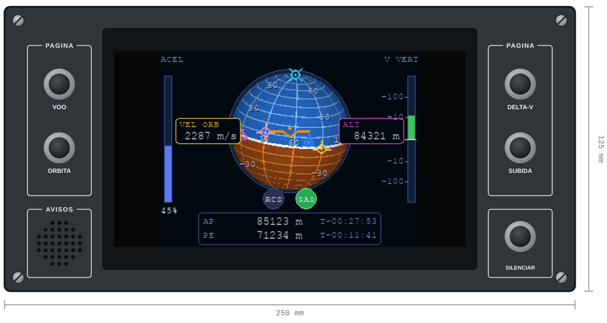

- **Uma tela só, de 7", no meio:** a Waveshare de 1024 × 600 com toque, ligada no HDMI do Pi, mostrando em tela cheia a mesma página do celular ([docs/mfd.md](../docs/mfd.md)). Ocupa a altura toda do painel duplo, sem título. A mikromedia saiu do cockpit; o firmware dela continua no repositório.
- **PAGINA:** quatro botões escolhem a página: VOO (a navball), ORBITA, DELTA-V e SUBIDA. As outras páginas (SAS, PILOTO, POUSO, MANOBRA, ALVO, TEMPO, EVA) abrem sozinhas quando o painel delas é mexido. Os botões não têm luz: a própria tela mostra a página.
- **AVISOS:** a grade do alto-falante USB dos [avisos de voo](../docs/avisos.md). **SILENCIAR** cala o aviso que está tocando.
- 5 entradas, nenhum LED: placa pequena.

## Painel de sistemas de controle

Na versão B, o painel **VOO**: os modos do SAS, os sistemas e o piloto automático de avião, num painel duplo embaixo da tela. O que cada controle faz está no roteiro do [piloto automático](../README.md#piloto-automático-de-avião) e no [protocolo](../docs/protocolo.md#painel-de-sistemas-de-controle).

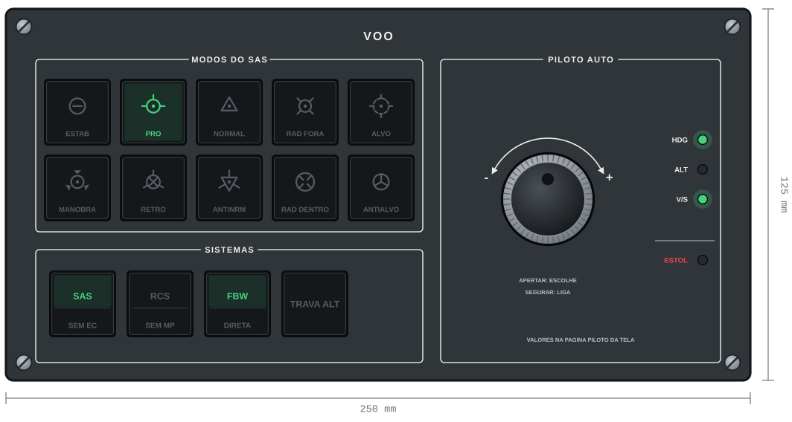

- **MODOS DO SAS:** os 10 modos em pares, o modo em cima e o oposto embaixo: ESTAB e MANOBRA, PRO e RETRO, NORMAL e ANTINRM, RAD FORA e RAD DENTRO, ALVO e ANTIALVO. A legenda é o marcador da navball, com a palavra embaixo. Cada korry tem um LED de duas cores: **azul** enquanto a nave vira para o marcador, **verde** quando chegou e o SAS segura nele, apagado quando o modo não está escolhido. Apertar um modo que o jogo não aceita (sem alvo, sem nó de manobra, SAS fraco) não faz nada.
- **SISTEMAS:** SAS, RCS, FBW e TRAVA ALT. A metade de baixo acende em âmbar quando falta alguma coisa: `SEM EC` (o SAS sem carga elétrica), `SEM MP` (o RCS sem monopropelente) e `DIRETA` (o avião no ar na lei direta).
- **PILOTO AUTO:** um encoder só para HDG, ALT e V/S, mexido pelo menu da página do piloto na tela multifunção: girar move o cursor, apertar escolhe a linha e girar muda o valor, apertar de novo sai, e segurar 1 s liga ou desliga o modo da linha. Três luzes verdes mostram, sem olhar a tela, quais modos estão ligados. Embaixo delas, a luz vermelha **ESTOL** pisca quando o ângulo de ataque passa de 14,5°, e a tela toca um alarme. É só o aviso: o FBW não mexe em nada ([docs/fbw.md](../docs/fbw.md#aviso-de-estol)).
- 17 entradas (10 modos, 4 korry e as 3 do encoder) e 31 LEDs: placa grande, com 4 × 74HC595. O desenho de 150 mm, com o mesmo conteúdo, está em [`img/antigos/sistemas.svg`](img/antigos/sistemas.svg).

## Painel do editor de manobras

Painel duplo, de 250 × 125 mm. O que cada controle faz está no [roteiro da fase 4](../README.md#fase-4--instrumentos-físicos) e no [protocolo](../docs/protocolo.md#no-painel).

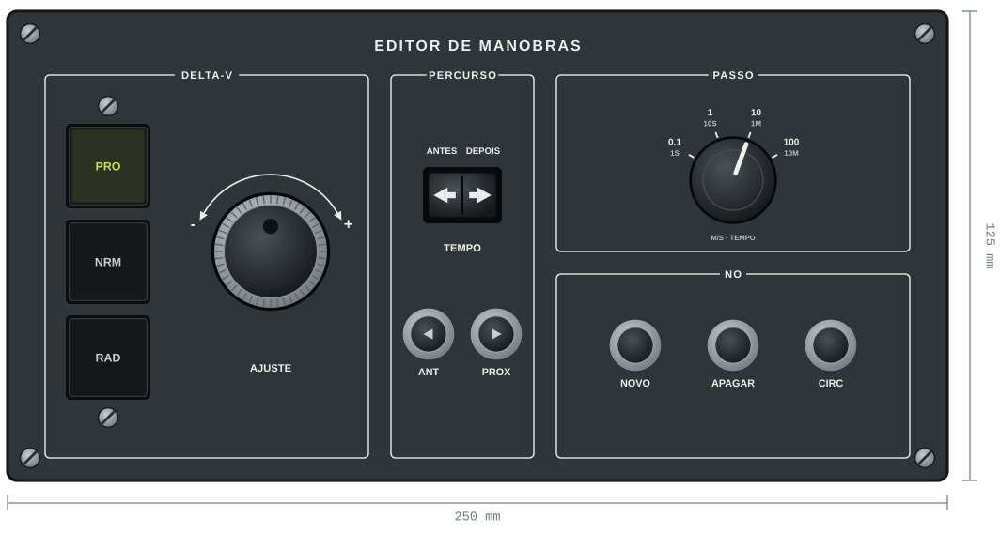

- **DELTA-V:** três korry escolhem o eixo (PRO, NRM, RAD), e o encoder mexe nele: horário soma, anti-horário tira. A legenda do eixo escolhido acende na cor da alça do nó no KSP: verde-amarelo, magenta e ciano.
- **PERCURSO:** anda pelo caminho da nave, nos dois sentidos. A tecla do TEMPO, deitada, move o nó pela órbita; ANT e PROX, embaixo dela e no mesmo sentido, trocam de nó.
- **PASSO:** chave rotativa com a legenda gravada em volta. O ponteiro do knob mostra o passo, sem LED e sem olhar a tela.
- **NO:** NOVO, APAGAR e CIRC, botões de metal: não têm estado para mostrar.
- **Sem tela:** os números do nó vão para a página do editor na tela multifunção.
- 16 entradas e 3 LEDs: placa média. O desenho de 150 mm está em [`img/antigos/editor_manobras.svg`](img/antigos/editor_manobras.svg).

## Ação executiva

STAGE, ABORT e os scripts de voo, no centro, a um palmo do acelerador.

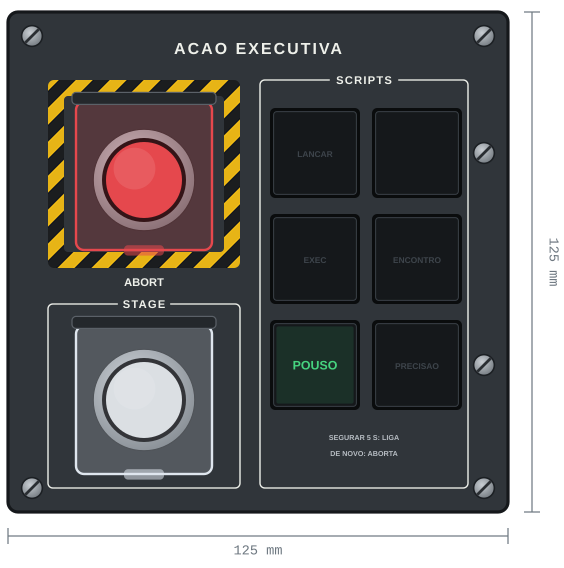

- **ABORT** na faixa zebrada e **STAGE** embaixo, os dois botões de metal de 22 mm debaixo de uma capa transparente que abre. O anel de LED de cada um mostra o estado: o ABORT acende em vermelho depois de acionado (`control.abort`); o STAGE, em âmbar, com a trava de estágio do jogo ligada (`control.stage_lock`).
- 8 entradas e 14 LEDs, com os scripts: placa média.

### Painel de scripts

Os scripts de voo que pilotam a nave sozinhos, um korry por script, na metade direita da ação executiva. O que o script faz está no roteiro da [fase 5](../README.md#fase-5--protocolo-v1--scripts-de-voo) e no [protocolo](../docs/protocolo.md#painel-de-scripts).

- **Na ordem do voo:** três fileiras de cima para baixo, como a nave: subida (LANCAR), órbita (EXEC e ENCONTRO) e descida (POUSO e PRECISAO). O POUSO fica embaixo, o mais perto da mão.
- **Segurar 5 s:** o korry só liga o script depois de 5 s apertado, e segurar de novo 5 s aborta: o script corta o motor e devolve a nave ao piloto. Soltar antes não faz nada. Assim não precisa de chave ARM, e um toque sem querer não entrega a nave. Enquanto conta, a tela multifunção abre a página do script e mostra quantos segundos faltam.
- **A luz mostra o script, não o aperto:** apagado parado; **âmbar piscando** enquanto conta para ligar; **verde** com o script voando (piscando âmbar enquanto conta para abortar); **vermelho** por 10 s se o script foi abortado ou falhou. Quando a nave pousa, apaga, e a tela mostra `POUSADA`.
- **Lugares vagos:** cinco korry com a legenda em cinza, esperando os próximos scripts do [roteiro](../README.md#scripts-de-voo). O korry ganha a legenda quando o script existir; o furo e os fios já ficam prontos.
- **Sem tela:** a fase, a altura, a descida e a freada aparecem na página POUSO da tela multifunção ([docs/mfd.md](../docs/mfd.md#painel-de-scripts-e-a-página-do-pouso)).
- O desenho de 150 mm, quando os scripts tinham painel próprio, está em [`img/antigos/scripts.svg`](img/antigos/scripts.svg).

## Tempo

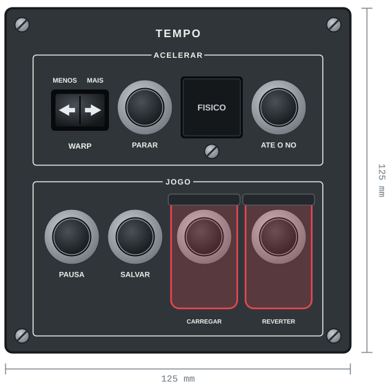

- **ACELERAR:** a tecla do WARP, deitada como a do editor: para a esquerda mais devagar, para a direita mais rápido (`rails_warp_factor` e `physics_warp_factor`). Segurando, repete. **PARAR** volta ao tempo normal. **FISICO** escolhe o warp físico e acende em branco com ele ligado (`warp_mode`). **ATE O NO** acelera até o próximo nó de manobra (`warp_to`).
- **JOGO:** PAUSA (`krpc.paused`), SALVAR (`quicksave`), CARREGAR (`quickload`) e REVERTER (volta ao lançamento, `revert_to_launch`). Os dois últimos perdem o voo atual e ficam debaixo de capas "missile".
- 9 entradas e 1 LED: placa média.

## Navegação

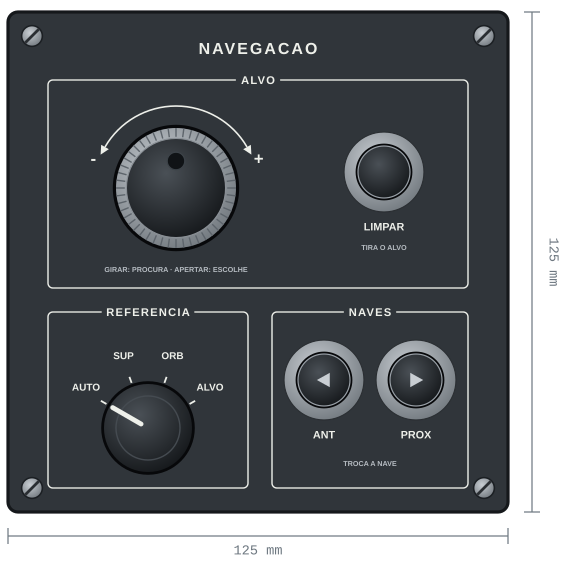

- **ALVO:** girar o encoder percorre as naves e os planetas na página ALVO da tela; apertar escolhe (`target_vessel`, `target_body`). LIMPAR tira o alvo (`clear_target`).
- **REFERENCIA:** o modo da navball: AUTO (troca sozinho, como no KSP), SUP, ORB ou ALVO. A ponte deixa a navball do jogo igual (`control.speed_mode`).
- **NAVES:** ANT e PROX trocam a nave ativa (`active_vessel`).
- 10 entradas, nenhum LED: placa média.

## Action groups

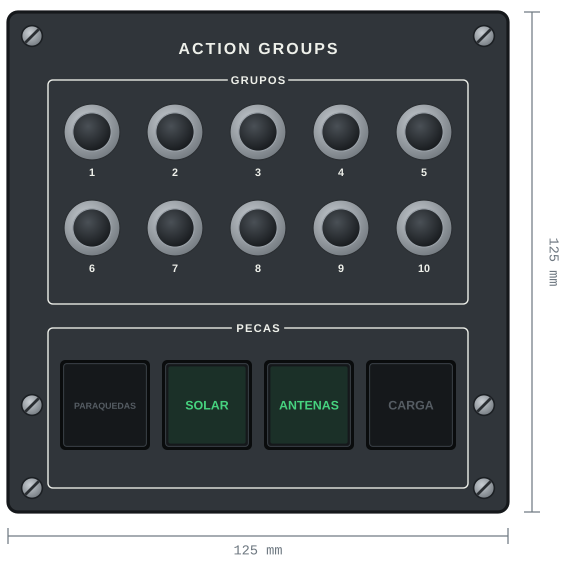

- **GRUPOS:** os action groups 1 a 10, botões de metal (`toggle_action_group`). Não têm luz: o que cada grupo faz muda de nave para nave.
- **PECAS:** PARAQUEDAS, SOLAR, ANTENAS e CARGA (`control.parachutes`, `solar_panels`, `antennas`, `cargo_bays`), em korry verdes que acendem com as peças abertas.
- 14 entradas e 4 LEDs: placa média.

## Câmera

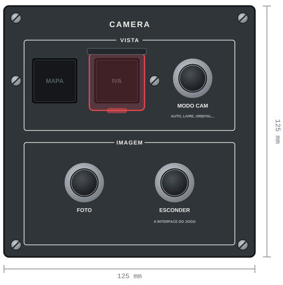

- **VISTA:** MAPA e IVA, korry brancos que acendem com o mapa aberto e com a vista de dentro da cabine (`camera.mode`). O IVA fica debaixo de uma capa. MODO CAM passa pelos modos da câmera: automático, livre, perseguição, travado e orbital.
- **IMAGEM:** FOTO (`screenshot`, salva no PC do jogo) e ESCONDER, que esconde a interface do jogo (`ui_visible`).
- O modo do manche saiu daqui: é o botão do [sidestick](#sidestick).
- 5 entradas e 2 LEDs: placa pequena.

## Recursos e EVA

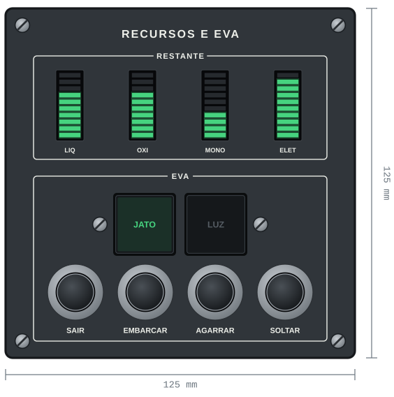

- **RESTANTE:** quatro barras de 10 LEDs, com o que resta no estágio atual de combustível líquido, oxidante, monopropelente e eletricidade. As barras são acesas por um MAX7219 ligado direto no Mega, fora do backplane.
- **EVA:** o kerbal fora da nave. JATO abre a mochila e LUZ liga a lanterna do capacete; SAIR, EMBARCAR, AGARRAR e SOLTAR (a escada). Andar, virar e voar com a mochila são feitos pelo sidestick, e a barra MONO mostra a mochila.
- **Precisa do kRPC 0.7:** no 0.6, o kRPC não mexe num kerbal em EVA (`control.rcs` e `lights` só ligam os grupos da nave, e não há como andar, sair ou embarcar). O 0.7 traz tudo isso, mas ainda não foi lançado. Não há comando para pular em nenhuma versão.
- 6 entradas e 2 LEDs: placa pequena.

## Acelerador

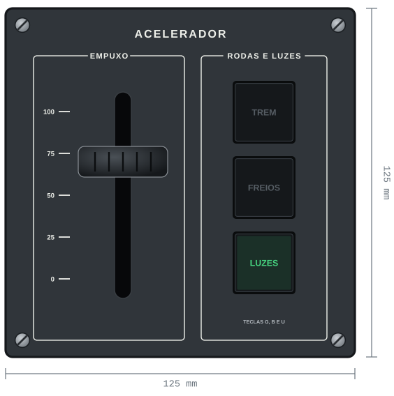

- **EMPUXO:** um potenciômetro deslizante de 60 mm (Bourns PTA6043), com uma alavanca impressa. Para cima acelera. É o único acelerador: a alavanca do joystick não é usada.
- **RODAS E LUZES:** TREM, FREIOS e LUZES (`control.gear`, `brakes`, `lights`), em korry verdes, ao lado do acelerador, como num avião.
- 3 entradas, 3 LEDs e 1 linha analógica: placa pequena num dos slots 1 a 5.

## Sidestick

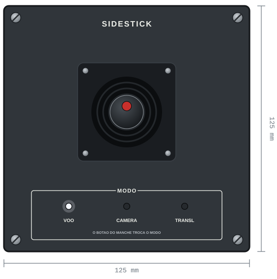

- **O joystick:** um JH-D400X-R4 para Arduino, com 3 eixos de 10 kΩ (X e Y ±25 a 30°, torção ±45°) e um botão no topo. Na ponta da asa direita, como o sidestick de um Airbus. Fios: VCC, GND, os 3 eixos e o botão.
- **Lido pelo Mega:** os 3 eixos vão nas 3 linhas analógicas de um dos slots 1 a 5 do backplane; o botão e as luzes, numa placa pequena. A ponte recebe os eixos pela serial e os manda ao jogo como faria com o Extreme 3D Pro.
- **O botão troca o modo:** cada aperto passa para o próximo, VOO, CAMERA e TRANSL, e volta ao VOO ([os três modos](#um-joystick-três-modos)). A ponte só troca com o manche no centro, para não dar tranco. Três luzes brancas mostram o modo, porque um botão não tem posição.
- **Em EVA**, o manche anda e voa com o kerbal (kRPC 0.7).
- 1 entrada, 3 LEDs e 3 linhas analógicas: placa pequena.

## Korry switches

O **korry** é o botão iluminado quadrado dos aviões: a legenda fica no próprio botão e acende. Muitos têm a legenda dividida em duas metades, cada uma com a sua luz: em cima o sistema (`SAS`), embaixo um aviso (`OFF`, `FAULT`).

### Por que usar

O korry combina com o princípio do painel: **o botão só manda "apertei", e a luz mostra o estado do jogo.**

Com uma chave alavanca, a chave pode ficar para cima com o SAS desligado pelo jogo, e o piloto tem que olhar o LED para saber a verdade. O korry não tem posição: cada toque pede "troque o estado", e a legenda acesa é sempre o que o jogo diz. Não há como a chave e o jogo discordarem.

- **Bons candidatos:** tudo que o jogo também pode mudar sozinho, ou pelo teclado. SAS, RCS, luzes, freios, trem de pouso, action groups, modos do piloto automático de avião (HDG, ALT, V/S, SPD).
- **Continuam como chave alavanca com capa:** o que precisa de duas ações de propósito. STAGE e ABORT continuam como botões grandes, com capa. Os scripts não precisam de chave ARM: o korry do script só liga segurado 5 s ([painel de scripts](#painel-de-scripts)).

### Como fazer

A peça tem ficha própria em [korry/](korry/README.md): medidas, desenho, peças, circuito, brilho e o que cada luz diz. Resumo:

- **Um tamanho só, 22,5 × 22,5 mm**, em todo o cockpit. Furo de 23 × 23 mm no painel.
- **Legenda em duas metades**, como o START do A320: em cima só as letras, embaixo as letras numa caixa. Ou uma legenda única, sem a divisória.
- **Legenda modular em duas cores, encaixada na ponta de um corpo igual para todos:** a legenda é impressa em preto e transparente numa peça só, com as letras vazadas numa camada preta. Só ela muda de korry para korry. Sem laser e sem cola.
- **Uma grade por grupo:** as bases dos korry de um grupo saem numa peça só, impressa em preto e parafusada atrás do painel com M3 pela frente (furo de 3,2 mm no painel). Os korry ficam a no mínimo 25,5 mm de centro a centro, e os parafusos aparecem nos desenhos dos painéis. Ver [Fixação no painel](korry/README.md#fixação-no-painel).
- **Chave PSW 8,5 × 8,5 e os LEDs encaixados num suporte impresso**, com um LED por metade e a chave no meio, que o apoio da divisória aperta. Um rabicho de 4 fios com JST-XH: GND, botão, LED de cima e LED de baixo.
- **LEDs comuns, pelas saídas do 74HC595 do módulo.** A cor é a do LED, fixa por metade.

**Alternativa pronta:** botões quadrados iluminados de 16 mm, vendidos no AliExpress. São mais fáceis, mas têm uma luz só, de uma cor, e a legenda fica por conta própria.

### No painel e no firmware

- **Cada korry usa 1 entrada e 1 ou 2 LEDs** de um módulo. A legenda de duas metades gasta mais LEDs que entradas, o contrário das chaves: a [tabela de seções](README.md#qual-placa-e-qual-etiqueta-em-cada-seção) já conta os LEDs dos korry da versão B.
- **Protocolo:** o korry manda um evento de botão (`BTN SAS 1`) em vez de chave (`SW SAS 1`), e a ponte inverte o estado no jogo. A mudança fica toda na ponte: o firmware já manda botões.

## Joystick: Logitech Extreme 3D Pro

**Fora do cockpit da versão B:** no painel, o manche é o [sidestick](#sidestick) e o acelerador é a [alavanca própria](#acelerador). O Extreme 3D Pro continua servindo para desenvolver e testar no PC (o FBW tem um perfil para ele, em [docs/fbw.md](../docs/fbw.md)). O mapeamento e os três modos abaixo valem para os dois.

**O que ele tem:** 4 eixos (X, Y, torção do manche e uma alavanca de acelerador na base), 12 botões e um chapéu (*hat*) de 8 direções no topo. Liga por USB e o computador o vê como um joystick comum (HID).

### Como entra no projeto

**Ligado na USB do Pi e lido pela ponte**, que manda os comandos para o jogo pelo kRPC. O jogo não enxerga o joystick.

```
 Extreme 3D Pro ──USB──▶ Raspberry Pi (ponte) ──kRPC──▶ KSP
```

- **Por que assim:** o joystick passa pelo mesmo lugar que o painel. A ponte pode aplicar zona morta, curva de resposta e os modos (voo, câmera e translação), e sabe na hora quando o piloto mexe no manche. Isso é o que devolve o controle ao piloto quando um script está voando (ver a [base comum dos scripts](../README.md#base-comum)).
- **Sem abrir o joystick:** ele continua inteiro e pode voltar a ser usado em outros jogos.
- **Leitura:** pelo `pygame`, que a ponte já usa, ou pelo `evdev`, direto no Linux. Decidir quando for escrever o código.
- **Durante o desenvolvimento no PC:** com o joystick ligado no PC, o KSP também o lê. Deixar os eixos do joystick sem nada nas configurações de controle do KSP, senão os comandos chegam em dobro.
- **O Pi 4 tem 4 portas USB:** Mega, mikromedia e joystick cabem, e sobra uma.

### Um joystick, três modos

**Um joystick só**, sem um segundo para a translação: o **botão do manche do sidestick** passa pelos três modos, e três luzes mostram o modo atual. A ponte lê o botão e manda o manche para um lugar ou outro. (Antes era uma chave de 3 posições no painel.)

| Posição | Modo | O manche mexe em |
|---|---|---|
| Cima | **VOO** | A atitude da nave (ou do avião, pelo [fly by wire](../docs/fbw.md)) |
| Meio | **CÂMERA** | A câmera: a de voo, ou a do mapa quando ele está aberto. Substitui os botões de câmera provisórios do [editor de manobras](../docs/manobras.md#câmera-do-mapa-temporário) |
| Baixo | **TRANSLAÇÃO** | O RCS, para mover a nave sem girar: frente, trás, lados, cima e baixo. É o modo do acoplamento (no KSP, *docking mode*) |

Só uma proposta de mapeamento, para testar no jogo e mudar à vontade. O código fica para outra tarefa.

| Controle do joystick | VOO | CÂMERA | TRANSLAÇÃO (RCS) |
|---|---|---|---|
| Y (frente e trás) | Pitch | Inclina a câmera (cima e baixo) | Para cima e para baixo |
| X (lados) | Roll | Gira a câmera em volta do foco | Para os lados |
| Torção | Yaw | Aproxima e afasta (zoom) | Frente e trás |
| Alavanca da base | Acelerador | Acelerador | Acelerador |
| Chapéu | Olhar em volta, sem sair do modo | No mapa: troca o foco (nave, nó de manobra, planeta) | Olhar em volta |
| Gatilho | Segurar para mexer devagar (precisão) | Idem | Idem |
| Botão do polegar | Livre (a troca de modo foi para a chave) | Livre | Livre |
| Botões da base | Livres: action groups, trocar de nave | — | — |

- **Fora do modo VOO, a nave não recebe o manche:** a ponte manda pitch, roll e yaw zerados, e o SAS segura a atitude. No modo CÂMERA dá para olhar em volta com a nave parada no rumo.
- **As luzes mostram o modo:** um LED por modo no painel do sidestick, e o modo escrito na tela multifunção. Mudar de modo com o manche fora do centro não pode dar um tranco: a ponte só passa o manche para o modo novo depois que ele volta ao centro.
- **TRANSLAÇÃO pede o RCS ligado.** Se estiver desligado, a ponte avisa (LED do RCS piscando ou na tela); ligar sozinha fica a decidir.
- **STAGE e ABORT não vão no joystick:** ficam só no painel, debaixo das capas, para não serem apertados sem querer.
- **O botão MAPA** (liga e desliga o mapa) fica no painel da câmera.

### Acelerador

A alavanca da base do joystick é curta (uns 3 cm de curso). No cockpit, o acelerador é uma alavanca própria, com um potenciômetro deslizante de 60 mm, no [painel do acelerador](#acelerador). A alavanca do joystick não é usada.

### Na mesa

Para desenvolver no PC, o Extreme 3D Pro fica solto na mesa. No cockpit, o sidestick é um painel, sem joystick solto.

## Arquivos

- **Desenhos dos painéis:** em código, em [`desenho/`](desenho/README.md), com os SVG em [`img/`](img/).
- **Korry:** o modelo no OpenSCAD, os STL e o desenho da ligação em [`korry/`](korry/README.md).
- **Caixa (a fazer):** em `hardware/caixa/`, o arquivo-fonte de cada peça, paramétrico, e os SVG ou DXF para a laser e os STL para a impressora, gerados a partir do fonte.

Ferramenta de CAD: **OpenSCAD**, para as peças impressas. Desenha a peça com código, em texto, e o histórico fica legível no git, como o resto do projeto.

## Ordem para fazer

1. **Teste de folga e um korry de teste**, impressos e montados, ligados direto num pino do Mega como na [fase 2](../docs/fase2.md) ([korry/](korry/README.md#ordem-para-fazer)).
2. **Protótipo de papelão** da caixa em U, na escala real, com os furos desenhados à mão: o alcance das mãos, a inclinação e o lugar do acelerador e do sidestick.
3. **Plaquinha de teste na laser**, com os furos de cada peça, e as medidas conferidas no paquímetro.
4. **Um painel de seção de verdade**, por exemplo a ação executiva: gravado, com o módulo atrás e as capas no lugar.
5. **Caixa completa (fase 7).**

## A decidir

- JATO e LUZ na EVA: o RCS e o LUZES já abrem a mochila e ligam a lanterna do kerbal (kRPC 0.7). Podem sair, e o painel fica com mais espaço.
- A chave REFERENCIA da navegação: o modo da navball já troca sozinho e pelo toque na tela.
- EVA: esperar o kRPC 0.7, compilar do GitHub ou um programa no PC do jogo que aperta as teclas da EVA.
- O furo do joystick JH-D400X-R4, quando ele chegar.
- MDF pintado ou acrílico nos painéis definitivos, e se as legendas dos painéis serão iluminadas.
