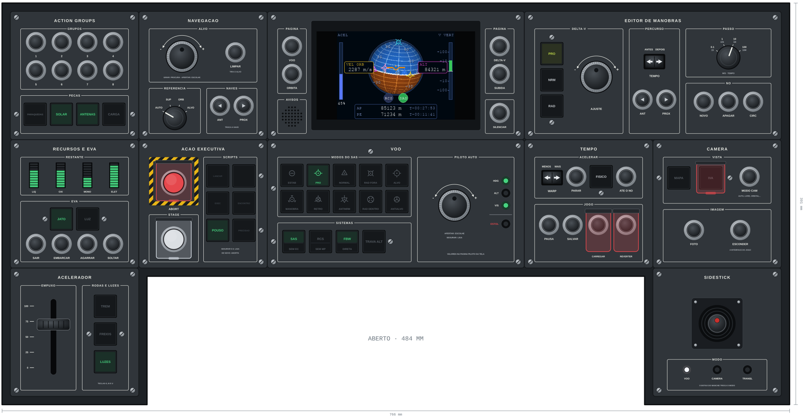

# Identidade visual do cockpit

Como todo painel do cockpit tem que parecer: cores, letras, medidas e peças. Vale para os painéis de verdade (laser e impressora) e para os desenhos. O exemplo de referência é o cockpit da [versão B](construcao.md#cockpit-versão-b):

A referência são os painéis de avião, como o overhead do A320 e o MCP do Boeing: sóbrios, cinza escuro, legendas brancas e botões iluminados. O KSP entra nos detalhes, como as cores das alças do nó de manobra.

## Painel

| O quê | Como é |
|---|---|
| Tamanho | **125 × 125 mm**, igual em todos. Uma seção que precise de mais espaço ocupa dois quadrados (250 × 125 mm), como a tela, o voo e o editor de manobras. Os desenhos antigos, de 150 mm, estão em [`img/antigos/`](img/antigos/) |
| Material | MDF ou acrílico de 3 mm, cortado e gravado a laser |
| Cor | Cinza escuro fosco, `#30353a` nos desenhos, com borda `#15181b` e cantos arredondados de 2,5 mm |
| Fixação | 4 parafusos M3 nos cantos, com o centro a 6 mm das bordas |
| Título | O nome da seção, gravado em cima e centrado, com letras de 4 mm. Ex.: `EDITOR DE MANOBRAS`. A tela multifunção não tem título: a tela de 7" ocupa a altura toda |
| Margem | Os grupos começam a 10 mm das bordas dos lados, para não bater nos parafusos |

## Grupos

Dentro do painel, os controles ficam em **grupos**, cada um com uma linha em volta e o nome interrompendo a linha de cima, como nos painéis de avião. Assim a mão acha o grupo sem olhar.

- Linha branca de 0,35 mm, cantos de 1,2 mm.
- Nome em cima, centrado, com letras de 2,8 mm.
- 6 mm entre grupos vizinhos.
- **O nome diz o que o grupo faz, e não o nome de um controle:** o grupo com o TEMPO, o ANT e o PROX se chama `PERCURSO`, porque anda pelo caminho da nave. Não repetir o nome de outra seção do cockpit (já existe uma `NAVEGACAO`).
- Em cima, o que ajusta; embaixo, o que age (criar, apagar, executar).

## Letras

- **Fonte:** [B612](https://fonts.google.com/specimen/B612), feita pela Airbus para as telas de cockpit e livre. Negrito nas legendas. Para números alinhados, B612 Mono.
- **Sempre maiúsculas e em ASCII, sem acentos**, como no LCD e na serial: `NO`, e não `NÓ`; `AMBAR`, e não `ÂMBAR`.
- **Cor:** branco `#eef0ea` para as legendas; cinza `#b9bfc5` para as legendas de apoio (unidades, lembretes como `M/S · TEMPO`).

| Onde | Altura das letras (tamanho no desenho) |
|---|---|
| Título do painel | 4 mm |
| Nome do grupo, nome de um controle | 2,8 a 3,2 mm |
| Legenda dos lados de um controle (`ANTES` / `DEPOIS`) | 2,4 a 2,6 mm |
| Legenda de apoio | 1,9 a 2,4 mm |

## Cores das luzes

Sempre com o mesmo significado:

| Cor | Significa | Exemplos |
|---|---|---|
| Verde | Sistema ligado, tudo normal; o modo assumiu | SAS, RCS, trem baixado; modo do SAS segurando |
| Azul | Armado: escolhido, mas ainda não assumiu | Modo do SAS com a nave virando para o marcador; ALT do piloto automático subindo até a altitude |
| Branco | Informação, modo escolhido | Página da tela |
| Âmbar | Atenção | Combustível baixo, script armado, pedido recusado |
| Vermelho | Perigo | ABORT, script abortado |

**A luz mostra o estado do jogo**, nunca a posição da chave nem o toque. O azul e o verde seguem os modos do piloto automático do Airbus: azul armado, verde ativo.

**Exceção: cores do KSP** onde a cor diz *qual* coisa é, e não um estado. Nos eixos do nó de manobra: verde-amarelo `#c6e04a` para o pró-grado, magenta `#d24fe0` para o normal e ciano `#40c9e3` para o radial, como as alças do nó no jogo.

## Peças

Sempre as mesmas peças, no mesmo tamanho, para os painéis combinarem e as peças servirem em qualquer lugar. Medidas de catálogo, a conferir no paquímetro.

| Peça | Na frente | Furo | Para quê |
|---|---|---|---|
| [Korry](korry/README.md) | 21,9 × 21,9 mm, passo de 25,5 mm | 23 × 23 mm | Tudo que liga, desliga ou escolhe e tem um estado no jogo: a legenda acesa é o estado. Nos modos do SAS, a legenda é o marcador da navball, com a palavra embaixo |
| Botão de 16 mm sem trava (R16-503) | anel Ø 20 mm, cabeça Ø 13 mm | Ø 16 mm, com um lado reto a 15 mm (furo em D) | Ações sem estado para mostrar: action groups, ANT e PROX, páginas da tela, FOTO |
| LED de 5 mm no suporte de plástico com porca | anel Ø 9 mm | Ø 6,5 mm | Mostrar um estado sem gastar um botão: os modos do piloto automático (verde), o ESTOL (vermelho, piscando), o modo do sidestick (branco) |
| Barra de 10 LEDs | 25,4 × 10,16 mm | 25,6 × 10,4 mm | Uma quantidade: o que resta de combustível, oxidante, monopropelente e eletricidade, e a mochila da EVA |
| Encoder EC11 com knob de alumínio | knob Ø 30 mm | Ø 7 mm | Ajustar um valor. Horário soma, anti-horário tira, com um arco `-` / `+` gravado em volta |
| Chave rotativa, 12 posições com batente | knob de ponteiro Ø 22 mm | Ø 10 mm | Escolher entre poucas opções fixas, com a legenda gravada em volta |
| Tecla basculante KCD1 com mola para o centro | 21 × 15 mm | 19 × 13 mm | Mover para um lado ou outro, como o WARP. Segurando, repete |
| Potenciômetro deslizante de 60 mm | rasgo de 74 × 6 mm, alavanca impressa | rasgo de 64 × 3 mm | O acelerador |
| Joystick de 3 eixos com botão | flange de ~50 mm | a medir | O sidestick |
| Botão de 22 mm com anel de LED | Ø 25 mm | Ø 22 mm | STAGE e ABORT, debaixo de capa transparente |
| Capa transparente para botão de 22 mm | 39 × 34 mm | colada | STAGE e ABORT |
| Capa impressa para o botão de 16 mm | 24 × 40 mm | a desenhar | CARREGAR e REVERTER, que perdem o voo atual |
| Capa impressa para korry | 27,5 × 28,5 mm | colada | IVA |

- **3 mm de borda a borda** entre peças vizinhas, no mínimo.
- **Botão de 16 mm: 23 mm de centro a centro** entre vizinhos, no mínimo (o anel de 20 mm mais 3 mm). Por isso o painel de action groups tem 8 botões, em duas fileiras de 4: 5 por fileira não cabem em 125 mm.
- **Korry: 25,5 mm de centro a centro** entre vizinhos, no mínimo (as bases de 25,3 mm da grade mais 0,2 mm). O `korry.scad` recusa menos que isso.
- **Parafusos das grades dos korry:** cada grupo de korry é preso atrás do painel por uma grade parafusada, com M3 pela frente num furo de 3,2 mm. Os parafusos ficam nas pontas do grupo, os da beira do painel a 6 mm da borda (alinhados com os parafusos de canto), e entram nos desenhos. Não podem cair em cima de outro controle, de uma legenda nem da linha do grupo. As posições estão em [`korry/grades.json`](korry/grades.json) e a explicação em [korry/README.md](korry/README.md#fixação-no-painel).
- **Zona de perigo:** faixa zebrada amarela e preta em volta, com capa de proteção. Só o ABORT.
- **Capa no que não tem volta:** ABORT, STAGE, IVA, CARREGAR e REVERTER.
- **Sem tela nos módulos:** os números vão para a tela multifunção, no meio do cockpit, que troca para a página do módulo em uso.

## Como organizar um painel

As regras que saíram dos desenhos:

1. **Korry só onde a luz diz alguma coisa.** O que não tem estado no jogo para mostrar (os action groups, NOVO, APAGAR) é botão de 16 mm.
2. **Um controle por coisa que se mexe junto.** O Δv nunca é mexido nos três eixos ao mesmo tempo, então é um encoder só, com korry para escolher o eixo.
3. **O controle se mexe como a coisa no jogo.** A tecla do TEMPO fica deitada: para a esquerda o nó volta na órbita, para a direita avança. ANT e PROX, embaixo, no mesmo sentido.
4. **Mostrar o estado sem olhar a tela** quando der de graça: a posição do knob da chave rotativa mostra o passo.
5. **O que se usa mais é maior ou fica mais à mão.**
6. **O que é perigoso fica longe e protegido.**

## Como organizar o cockpit

As regras que decidiram o lugar de cada painel na [versão B](construcao.md#cockpit-versão-b):

1. **A tela no meio, na altura dos olhos,** com os painéis que abrem páginas nela dos lados.
2. **O voo de todo dia no centro, perto das mãos:** os modos do SAS, os sistemas e a ação executiva, embaixo da tela.
3. **Como num avião:** o acelerador na mão esquerda e o sidestick na direita, nas pontas de baixo das asas.
4. **O que se usa junto fica junto:** o editor ao lado do tempo, a câmera ao lado do sidestick.
5. **O que se mexe com calma fica nas pontas de cima:** action groups e editor.
6. **Sem espaço vazio:** juntar controles num painel antes de aumentar a caixa.

## Desenhos

- **Unidades em milímetros**, com as peças no tamanho real e as cotas do painel.
- Feitos com as peças de [`desenho/pecas.js`](desenho/pecas.js); cada painel é um arquivo em [`desenho/paineis/`](desenho/paineis/), e `node hardware/desenho/desenhar.js` gera o SVG em `hardware/img/`. Como fazer um painel novo: [desenho/README.md](desenho/README.md).
- O desenho mostra o painel como ele fica ligado: o korry do estado atual aceso, o knob numa posição.
