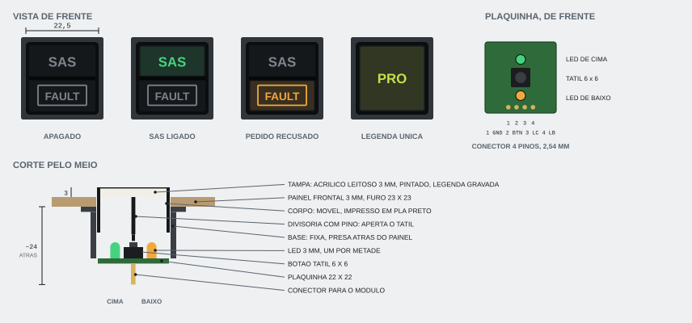

# Korry switch

O botão iluminado quadrado dos aviões, feito em casa: a legenda fica no próprio botão e acende. É uma peça só, **do mesmo tamanho em todo o cockpit**, usada em vários painéis. Por que usar korry e onde ele entra no painel está em [construcao.md](../construcao.md#korry-switches).

**Status: especificação, nada construído.** Esta pasta guarda tudo do korry: esta ficha, o desenho e, quando existirem, o arquivo-fonte do CAD, os STL e a placa no KiCad.



## Referências

- **Aparência:** o botão START do A320, com a legenda em duas metades: em cima `AVAIL`, só as letras; embaixo `ON`, dentro de uma caixa. Cada metade acende sozinha, na sua cor. Apagadas, as legendas continuam legíveis.
- **Circuito:** um korry feito em casa com uma plaquinha atrás da tampa, com o botão e os LEDs, e um conector de poucos pinos saindo por trás.

## Onde vai

| Painel | Korry | Legenda |
|---|---|---|
| Editor de manobras ([desenho](../construcao.md#painel-do-editor-de-manobras)) | 6 | PRO, NRM e RAD: uma legenda, acesa no eixo escolhido. NOVO, APAGAR e CIRC: uma legenda, sem LED |
| Sistemas de controle ([desenho](../construcao.md#painel-de-sistemas-de-controle)) | 14 | 10 modos do SAS: o marcador da navball com a palavra embaixo, LED azul e verde. SAS, RCS e FBW: duas metades. TRAVA ALT: uma legenda |
| Scripts ([desenho](../construcao.md#painel-de-scripts)) | 6 | POUSO: uma legenda, LED vermelho e verde (âmbar com os dois). Os outros cinco, vagos: tampa lisa até o script existir |
| Action groups | a decidir | 1 a 10: uma legenda |

São uns 36 no cockpit inteiro. Vale fazer em série: uma peça bem resolvida, repetida.

## Medidas

| O quê | Medida | Observação |
|---|---|---|
| Frente | **22,5 × 22,5 mm** | Igual em todos. Perto do tamanho dos botões do A320 |
| Furo no painel | 23 × 23 mm | 0,25 mm de folga por lado. Conferir na plaquinha de teste da laser, que queima um pouco em volta do corte |
| Saliência na frente do painel | 3 mm | A tampa de acrílico |
| Atrás do painel | ~24 mm | Até a ponta do conector. Somar o cabo |
| Distância entre korry vizinhos | 3 mm | De borda a borda. 1 mm já cabe, mas fica apertado para o dedo |
| Legenda de cima | letras de 3 mm de altura, até 6 letras | Só as letras |
| Legenda de baixo | letras de 2,5 mm, dentro de uma caixa de 15 × 6 mm | Como o `ON` do A320 |
| Legenda única | letras de 3 mm, centradas | Sem a divisória |

## Peças

```
  frente
    │
    ▼   ┌───────────────────────┐ ← tampa: acrílico branco leitoso 3 mm,
        │         S A S         │   pintado de preto, legenda gravada a laser
        │───────────┬───────────│ ← divisória, com um pino no meio
        │     ┌───────────┐     │
        │     │   FAULT   │     │ ← corpo: móvel, desliza na base
        │     └───────────┘     │
        ├──┐       │        ┌───┤ ← base: fixa, presa atrás do painel frontal
        │  │  LED  ▼  LED   │   │
        │  │  ▲   [tátil]  ▲    │ ← o pino da divisória aperta o botão tátil
        └──┴──┴────────────┴────┘ ← plaquinha 22 × 22 mm
                  ║║║║            ← conector de 4 pinos para o módulo
```

- **Tampa:** acrílico branco leitoso de 3 mm, cortado a laser, pintado de preto por cima. A laser tira a tinta só nas letras e na caixa, e a luz de trás passa por elas. Apagada, a legenda aparece em cinza claro, legível de dia.
- **Corpo:** impresso em PLA preto, com a tampa colada na frente. É a parte que se mexe quando o dedo aperta.
- **Divisória:** uma parede no meio do corpo separa as duas metades, para a luz de cima não vazar para baixo. Tem um pino no centro, que aperta o botão tátil. Para a legenda única, a divisória fica mais baixa, só com o pino, e as duas metades viram uma câmara só.
- **Base:** impressa, presa atrás do painel frontal por dois parafusos M2 (ou uma presilha). Segura o corpo pelas laterais e a plaquinha no fundo.
- **Plaquinha:** 22 × 22 mm, com um LED para cada metade e o botão tátil no meio. Protótipo em placa perfurada; na fase 7, uma placa fabricada, feita junto com os módulos.
- **Botão tátil:** 6 × 6 mm. A mola dele devolve o corpo. O curso é curto, como no botão do avião; se ficar curto demais, trocar por um microswitch de alavanca.

## Circuito

```
  módulo                               korry
  ──────                               ─────
  INn   ─────────────── 2 BTN ────┐
                                  └─[ tátil ]──┐
  LEDn  ──[1 kΩ]─────── 3 LC ───►|─ LED de cima ─┤
  LEDm  ──[1 kΩ]─────── 4 LB ───►|─ LED de baixo ┤
  GND   ─────────────── 1 GND ─────────────────┘
```

- **Não tem CI nem resistor no korry.** O pull-up da entrada e os resistores dos LEDs já estão no módulo (ver o [README do hardware](../README.md#no-módulo)). O korry é só botão, LEDs e fios.
- **Conector de 4 pinos, passo de 2,54 mm:** 1 GND, 2 BTN, 3 LC (LED de cima), 4 LB (LED de baixo). Barra de pinos com cabo dupont no protótipo; JST-XH de 4 vias na versão final, para não soltar.
- **Apertado lê 0**, como qualquer botão dos módulos.
- **Cada korry gasta 1 entrada e 0, 1 ou 2 saídas de LED:**
  - duas metades: 2 saídas;
  - legenda única acesa: 1 saída, com os dois LEDs em paralelo nela;
  - legenda única sem luz (NOVO, APAGAR, CIRC): nenhuma, e os LEDs nem são montados;
  - legenda única de duas cores (os modos do SAS): 2 saídas, com um LED azul e verde de catodo comum. O pino 3 (LC) acende o azul, o 4 (LB) o verde; o conector e o circuito não mudam.
- **A cor é a do LED**, escolhida na montagem, porque a tampa é branca. Uma cor fixa por metade, das cores da [identidade visual](../identidade_visual.md#cores-das-luzes): verde, azul, branco, âmbar ou vermelho. Os modos do SAS têm as duas cores no mesmo LED. A exceção são os korry de eixo do editor, nas cores das alças do nó no KSP (verde-amarelo, magenta e ciano), porque a cor ali diz qual é o eixo, e não um estado.

### Brilho

Com o resistor de 1 kΩ do módulo, cada LED recebe uns 3 mA (uns 2 mA os brancos). Atrás de 3 mm de acrílico leitoso pode ser pouco.

1. Testar primeiro com 1 kΩ, no escuro e de dia.
2. Se ficar fraco, trocar o resistor daquela saída no módulo por 470 Ω: uns 6 mA por LED.
3. Não passar de uns 8 mA por LED: cada 74HC595 aguenta 70 mA no total, e com 8 LEDs acesos juntos 8 mA já dá 64 mA.
4. Na legenda única com dois LEDs na mesma saída, a corrente se divide entre os dois: é o caso que mais pede 470 Ω.

## O que as luzes dizem

Como em todo o painel, **a luz mostra o estado do jogo, nunca o toque**. O korry só avisa "apertei" (`BTN SAS 1`); a ponte decide e o LED acende quando o jogo confirma. O firmware não muda: já manda botões e acende LEDs.

| Metade | Acende quando | Exemplo |
|---|---|---|
| Cima | O sistema está ligado no jogo | `SAS` verde: o SAS está ligado |
| Baixo, na caixa | Algo pede atenção | `FAULT` âmbar: o pedido foi recusado, por exemplo a nave não tem SAS. A ponte acende por uns segundos |
| Única | O estado ou modo está escolhido | `PRO` verde-amarelo: o encoder mexe no pró-grado |
| Única, duas cores | Azul: o modo foi escolhido e ainda não assumiu. Verde: assumiu | Modo do SAS: azul com a nave virando, verde com ela no marcador |

## Lista de peças (um korry)

- 1 botão tátil 6 × 6 mm, de 5 mm de altura.
- 0 a 2 LEDs de 3 mm, difusos, de alto brilho, na cor da legenda. Nos modos do SAS, 1 LED azul e verde de 3 mm, difuso, de catodo comum.
- 1 plaquinha de 22 × 22 mm (placa perfurada no protótipo).
- 1 barra de pinos de 4 vias (ou JST-XH de 4 vias) e cabo de 4 fios.
- Corpo, divisória e base impressos em PLA preto.
- 1 tampa de acrílico branco leitoso de 3 mm, 20,5 × 20,5 mm, cortada e gravada a laser.
- 2 parafusos M2 × 6 para prender a base.

## Ordem para fazer

1. **Um korry de teste**, ligado direto num pino do Mega como na [fase 2](../../docs/fase2.md): o clique, a folga do corpo na base e o brilho, com 1 kΩ e com 470 Ω.
2. **Tampas de teste na laser:** tinta, profundidade da gravação e tamanho das letras. Ver de dia e no escuro.
3. **Os 6 do editor de manobras**, no primeiro painel de verdade.
4. **A plaquinha no KiCad**, quando o desenho estiver firme, para fabricar junto com os módulos na fase 7.

## A decidir

- Tinta e profundidade da gravação da tampa, depois do teste na laser.
- Se o curso do botão tátil agrada, ou se vale um microswitch.
- LEDs de 3 mm ou SMD na plaquinha fabricada.
- Quais seções usam korry, e quantos (tabela de [placas e etiquetas](../README.md#qual-placa-e-qual-etiqueta-em-cada-seção)).
