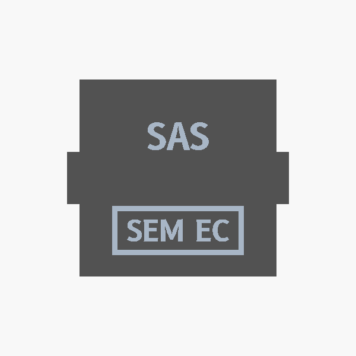
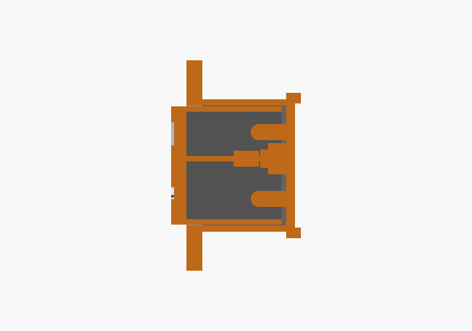
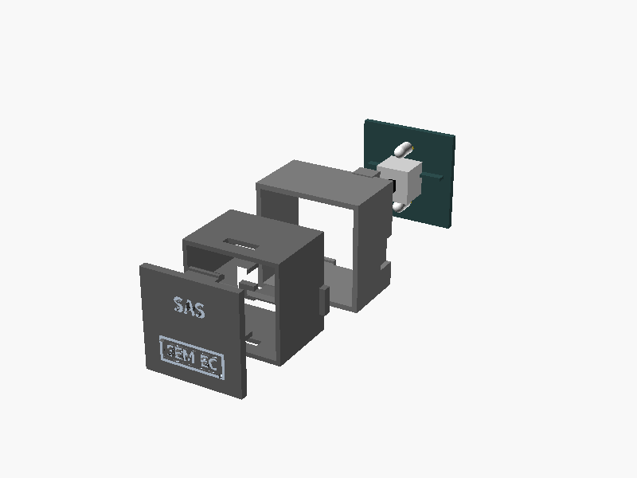
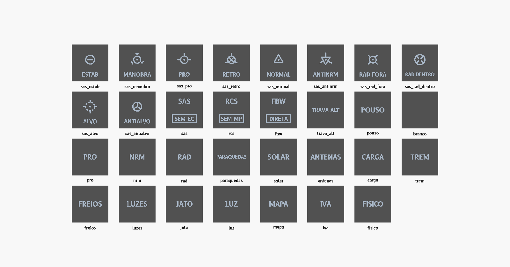
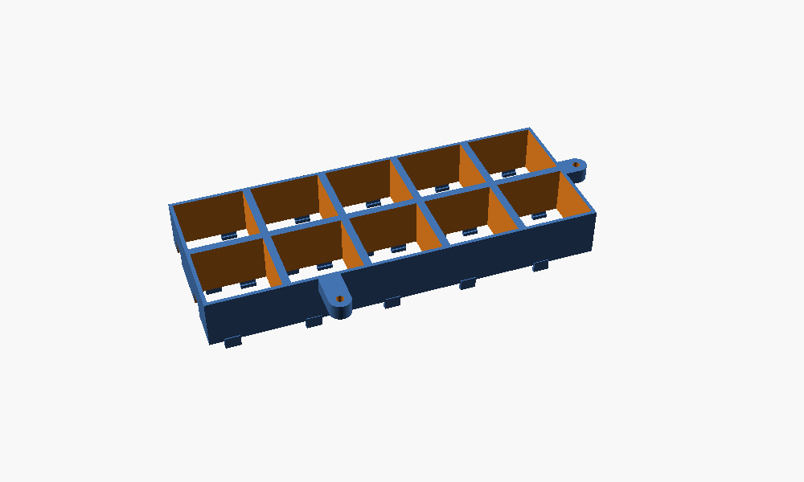
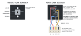

# Korry switch

O botão iluminado quadrado dos aviões, feito em casa: a legenda fica no próprio botão e acende. É uma peça só, **do mesmo tamanho em todo o cockpit**, usada em vários painéis. Por que usar korry e onde ele entra no painel está em [construcao.md](../construcao.md#korry-switches).

**Status: modelo pronto para o primeiro teste de impressão, nada construído.** São quatro peças impressas e não há placa perfurada, peça de laser nem placa fabricada: a chave e os LEDs encaixam direto num suporte impresso. Só a **legenda**, em duas cores, muda de korry para korry; o **corpo**, o **suporte** e a **base** são pretos e iguais para todos. No cockpit, as bases de um grupo de korry saem numa peça só, a **grade**, parafusada atrás do painel ([Fixação no painel](#fixação-no-painel)). A base solta fica para o teste.

| Frente | Corte | Peças |
|---|---|---|
|  |  |  |

## Arquivos

| Arquivo | O que é |
|---|---|
| [`korry.scad`](korry.scad) | O modelo no [OpenSCAD](https://openscad.org/), com as medidas e a legenda nas primeiras linhas. Para as letras saírem certas, instalar a fonte [B612](https://fonts.google.com/specimen/B612) Bold |
| [`stl/legendas/`](stl/legendas/) | As 31 legendas, cada uma em dois arquivos, `<nome>_preto.stl` e `<nome>_transparente.stl`, nas mesmas coordenadas, para imprimir junto com os dois bicos. A lista está em [Legendas](#legendas). A de teste é `sas_preto.stl` e `sas_transparente.stl` (`SAS` / `SEM EC`) |
| [`stl/korry_corpo.stl`](stl/korry_corpo.stl) | O corpo, igual para todos. Preto, um bico só |
| [`stl/korry_base.stl`](stl/korry_base.stl) | A base solta, de um korry só, para o teste. Preta, um bico só |
| [`stl/korry_suporte.stl`](stl/korry_suporte.stl) | O suporte da chave e dos LEDs. Preto, um bico só |
| [`stl/grades/`](stl/grades/) | As 9 grades de fixação, uma por grupo de korry: `grade_<nome>.stl`. Pretas, um bico só. Ver [Fixação no painel](#fixação-no-painel) |
| [`grades.json`](grades.json) | Onde ficam os korry e os parafusos de cada grade, nas coordenadas do desenho do painel. Lido pelo `gerar.py` e pelo `desenhar.js` |
| [`gerar.py`](gerar.py) | Gera os STL (legendas, peças iguais e grades) e as imagens: `python hardware/korry/gerar.py` |
| [`stl/korry_teste.stl`](stl/korry_teste.stl) | O teste de folga: 5 encaixes de 0,35 a 0,6 mm e um pedaço do corpo (o primeiro teste, de 0,1 a 0,3 mm, ficou apertado em todos; o segundo deu 0,5 mm) |
| [`ligacao.js`](ligacao.js) | Gera [`ligacao.svg`](ligacao.svg), o desenho da ligação da chave e dos LEDs: `node hardware/korry/ligacao.js` |
| [`korry.svg`](korry.svg) | O desenho da primeira especificação, com a tampa de acrílico: os quatro estados da legenda continuam valendo |

### Gerar os STL e as imagens

O `gerar.py` usa só a biblioteca padrão do Python e roda de qualquer pasta. Precisa do `openscad` no PATH e da fonte B612 Bold instalada; para as imagens, sem tela, usa o `xvfb-run`. Os STL saem em binário, para o repositório não crescer à toa.

```
python hardware/korry/gerar.py              tudo
python hardware/korry/gerar.py --legendas   as 31 legendas
python hardware/korry/gerar.py --pecas      corpo, base, suporte e teste
python hardware/korry/gerar.py --grades     as grades do grades.json
python hardware/korry/gerar.py --imagens    frente, corte, explodida, legendas e grade
```

Ao gerar as legendas, o script confere o tamanho de cada uma: nada passa de 9,75 mm do centro em `x` (0,5 mm de folga da borda interna da legenda), e nas de duas metades o texto de cima fica acima da divisória e o de baixo abaixo. Se falhar, para com a mensagem.

**Uma legenda nova** entra na tabela `LEGENDAS` do `gerar.py` (nome do arquivo, `texto_cima`, `texto_baixo` e `modo_sas`). Para só testar, direto no `openscad`, dentro de `hardware/korry/`:

```
openscad -D 'peca="legenda_preto"' -D 'texto_cima="RCS"' -D 'texto_baixo="SEM MP"' -o legenda_preto.stl korry.scad
openscad -D 'peca="legenda_transparente"' -D 'texto_cima="RCS"' -D 'texto_baixo="SEM MP"' -o legenda_transparente.stl korry.scad
openscad -D 'peca="legenda_preto"' -D 'modo_sas="PRO"' -o legenda_preto.stl korry.scad
```

Com `texto_baixo=""`, a legenda é única; com os dois textos vazios e sem `modo_sas`, é a em branco. Com `modo_sas` (`ESTAB`, `MAN`, `PRO`, `RETRO`, `NRM`, `ANRM`, `RFORA`, `RDENTRO`, `ALVO` ou `AALVO`), a legenda é de modo do SAS: o ícone em cima e a palavra embaixo, numa peça só. O tamanho das letras se ajusta ao texto: `PARAQUEDAS` e `RAD DENTRO` ficam com ~2,1 mm, e os textos curtos chegam a 3 mm. O corpo, a base e o suporte não mudam.

O `peca="corte"` do `korry.scad` mostra a montagem cortada ao meio, com a face cortada nas cores das peças; o `peca="montagem"` é a montagem inteira, sem corte; o `peca="legenda_2d"` exporta só o desenho 2D da legenda.

## Referências

- **Aparência:** o botão START do A320, com a legenda em duas metades: em cima `AVAIL`, só as letras; embaixo `ON`, dentro de uma caixa. Cada metade acende sozinha, na sua cor. Apagadas, as legendas continuam legíveis.
- **Circuito:** uma chave e dois LEDs encaixados num suporte impresso atrás do corpo, ligados por um rabicho de 4 fios com um conector de 4 vias na ponta.

## Onde vai

Na [versão B do cockpit](../construcao.md#cockpit-versão-b) são 35:

| Painel | Korry | Legenda |
|---|---|---|
| Voo | 14 | 10 modos do SAS: o marcador da navball com a palavra embaixo, LED azul e verde. SAS, RCS e FBW: duas metades. TRAVA ALT: uma legenda |
| Ação executiva | 6 | Os scripts: POUSO e cinco vagos, LED vermelho e verde (âmbar com os dois) |
| Editor de manobras | 3 | PRO, NRM e RAD: uma legenda, acesa no eixo escolhido |
| Action groups | 4 | PARAQUEDAS, SOLAR, ANTENAS e CARGA: uma legenda, verde |
| Acelerador | 3 | TREM, FREIOS e LUZES: uma legenda, verde |
| Recursos e EVA | 2 | JATO e LUZ: uma legenda, verde |
| Câmera | 2 | MAPA e IVA: uma legenda, branca. O IVA com capa |
| Tempo | 1 | FISICO: uma legenda, branca |

Os botões que não têm luz para mostrar (os action groups 1 a 8, NOVO, APAGAR, CIRC) viraram botões de 16 mm comuns.

## Legendas

São 31 legendas diferentes para os 35 korry: os cinco scripts vagos usam a mesma legenda em branco. Cada uma é um par de arquivos em [`stl/legendas/`](stl/legendas/), `<nome>_preto.stl` e `<nome>_transparente.stl`.



| Painel | Korry | Arquivos (`stl/legendas/`) |
|---|---|---|
| Voo, modos do SAS | 10 | `sas_estab`, `sas_manobra`, `sas_pro`, `sas_retro`, `sas_normal`, `sas_antinrm`, `sas_rad_fora`, `sas_rad_dentro`, `sas_alvo`, `sas_antialvo` |
| Voo, sistemas | 4 | `sas`, `rcs`, `fbw` (duas metades) e `trava_alt` |
| Ação executiva | 6 | `pouso` e cinco `branco` |
| Editor de manobras | 3 | `pro`, `nrm`, `rad` |
| Action groups | 4 | `paraquedas`, `solar`, `antenas`, `carga` |
| Acelerador | 3 | `trem`, `freios`, `luzes` |
| Recursos e EVA | 2 | `jato`, `luz` |
| Câmera | 2 | `mapa`, `iva` |
| Tempo | 1 | `fisico` |

- **Modos do SAS:** o ícone do marcador da navball em cima e a palavra embaixo (ESTAB, MANOBRA, PRO, RETRO, NORMAL, ANTINRM, RAD FORA, RAD DENTRO, ALVO, ANTIALVO), sem divisória, como uma legenda única. Os ícones são os mesmos do desenho do painel, com traço de 0,7 mm.
- **Legenda em branco:** a máscara preta inteira, sem letras, para os lugares vagos dos scripts. Quando o script existir, ganha a legenda dele.
- **IVA:** a legenda é a de sempre; a capa é uma peça à parte e a grade não mexe nela.

## Medidas

| O quê | Medida | Observação |
|---|---|---|
| Frente | **21,9 × 21,9 mm** | Igual em todos. É o vão da base (22,9 mm) menos a `folga` de 0,5 mm de cada lado, medida no teste de folga |
| Furo no painel | 23 × 23 mm | 0,55 mm de folga por lado. Conferir na plaquinha de teste da laser, que queima um pouco em volta do corte |
| Saliência na frente do painel | 3 mm | A legenda (1,8 mm) e 1,2 mm da frente do corpo. O corpo anda ~2,2 mm até a chave chegar ao fim (curso de 2,5 mm menos 0,3 mm de pré-carga) e a frente ainda sai ~0,8 mm do painel apertado |
| Corpo | 17,2 mm de comprimento | 16 mm atrás do painel, até os ressaltos de trás, mais 1,2 mm na frente do painel, onde a legenda encaixa |
| Base | 25,3 mm de lado, 16 mm de fundo | Mais os ganchos, que chegam a 18,8 mm. O tubo de 25,3 mm cabe no passo mínimo de 25,5 mm |
| Grade | 25,3 mm por korry, 16 mm de fundo | As bases do grupo numa peça só, com orelhas de 7 mm de largura e 5 mm de espessura para os parafusos. A maior (`voo_sas`) tem uns 136 × 65 mm |
| Suporte | 24,1 × 24,1 × 1,6 mm | Preso pelos ganchos da base, por fora do tubo |
| Atrás do painel | ~22 mm | Até as pernas da chave, que saem atrás do suporte. Somar os fios |
| Distância entre korry vizinhos | 3 mm | De borda a borda, ou **25,5 mm de centro a centro**: é o passo mínimo. O `korry.scad` recusa uma grade com korry mais perto |
| Legenda | 21,9 × 21,9 × 1,8 mm | Encaixa por pressão na ponta do corpo, com duas abas. Máscara preta de 0,6 mm na frente e 1,2 mm de transparente atrás |
| Legenda de cima | letras de até 3 mm | B612 Bold. O tamanho se ajusta ao texto (fator de largura 0,85): TRAVA ALT e as palavras longas ficam menores |
| Legenda de baixo | letras de até 2,4 mm, numa caixa de até 15 × 5,6 mm | Como o `ON` do A320. A caixa acompanha o texto |
| Legenda única | letras de até 3 mm, centradas | Sem a divisória. As mais apertadas, PARAQUEDAS e RAD DENTRO, ficam com ~2,1 mm |
| Legenda dos modos do SAS | ícone em cima, palavra de até 2,4 mm embaixo | Sem a divisória. Traço do ícone de 0,7 mm |
| Chave | PSW 8,5 × 8,5 mm, 8 mm de altura | O êmbolo sai 5,5 mm e tem 2 × 3 mm |
| Curso da chave | ~2,5 mm | Conferir na chave real |
| Divisória | No centro do korry | A do corpo começa 4 mm atrás da legenda. Na legenda única, a luz das duas metades se mistura nesse vão; na de duas metades, uma aleta preta da legenda fecha o vão |

## Peças

- **Legenda**, impressa em duas cores numa peça só, de frente para baixo na mesa, com 1,8 mm de espessura. É a única peça que muda de korry para korry:
  - **Preto:** a borda de 1 mm, uma camada de 0,6 mm na frente com a legenda vazada e a divisória que separa a luz das duas metades. Atrás dela saem duas abas com dente, uma em cima e outra embaixo, que travam o corpo.
  - **Transparente:** as letras e o ícone, nos furos da camada preta, e o bloco de 1,2 mm atrás dela, dividido em dois pela divisória. Apagada, a legenda aparece clara; acesa, na cor do LED.
- **Corpo:** um tubo preto, igual para todos, em que a legenda encaixa por pressão (as abas entram nas janelas das paredes de cima e de baixo). Ele sai 1,2 mm na frente do painel, com a legenda na frente dele, e tem 16 mm atrás do painel. Na ponta de trás, dois ressaltos nos lados correm nos trilhos da base e seguram o corpo. Os ressaltos ficam **alternados**: em um lado acima do centro e no outro abaixo, para os trilhos de dois korry vizinhos de uma grade não se cruzarem na mesma parede. Por dentro tem uma divisória, que continua a da legenda, com um apoio que empurra o êmbolo da chave e asas que separam a luz dos lados da chave.
- **Base:** um tubo preto atrás do painel, com os trilhos por onde o corpo desliza e dois ganchos que prendem o suporte. Os ganchos ficam fora do suporte e também **alternados** (o de cima e o de baixo em posições diferentes ao longo da parede), para os de dois vizinhos não baterem. A base solta serve para o teste; no cockpit, as bases de um grupo saem juntas na **grade**. Não leva os parafusos M2 da primeira especificação: com 3 mm entre korry, as abas não cabem.
- **Grade:** as bases de um grupo de korry numa peça só, com as paredes entre vizinhos fundidas e orelhas com furo para o parafuso do painel. Ver [Fixação no painel](#fixação-no-painel).
- **Suporte:** uma plaquinha preta de 24,1 × 24,1 × 1,6 mm, com 6 furos para as pernas da chave, 4 para as pernas dos LEDs, uma nervura de cada lado da chave, logo acima da divisória, para a luz não passar por baixo das asas e a palavra `CIMA` gravada atrás. É igual para todos.
- **Chave PSW 8,5 × 8,5 mm, sem trava**, de 6 pinos. Usa um polo só: o comum e o contato que fecha apertado. A mola da chave devolve o corpo. O curso é curto, como no botão do avião.

## Fixação no painel

Os korry de um grupo ficam presos numa **grade**: uma peça preta com as bases do grupo juntas, encostada **atrás** do painel e parafusada nele. O corpo entra por trás na base da grade, antes do suporte, e sai pelo furo de 23 × 23 mm; a legenda encaixa nele pela frente, já com o painel montado. Sem cola, e a grade de cada grupo se tira e se põe de volta.



- **Parafuso:** M3 autoatarraxante, de 8 mm, **pela frente do painel**, com a cabeça na frente. O painel tem furo de 3,2 mm; a orelha da grade, de 2,5 mm, onde o parafuso abre a rosca no PLA. O painel (3 mm) mais a orelha (5 mm) dão os 8 mm do parafuso.
- **Orelhas:** 7 mm de largura, do furo até a parede da base mais próxima, com a ponta redonda. Ficam encostadas atrás do painel, no mesmo plano das bases.
- **Posição dos parafusos:** nas pontas do grupo, onde há espaço. Os que ficam perto da borda do painel ficam a 6 mm dela, alinhados com os parafusos de canto do painel.
- **Um parafuso só** na grade do FISICO, embaixo do korry, porque do lado não sobra lugar para o ATE O NO: o korry dentro do furo do painel impede a grade de girar em torno do parafuso.
- **Korry afastados** (a `vista`, com passo de 31 mm): o fechamento não une as bases sozinho, e a grade ganha uma barra de 6 mm no plano das orelhas.
- **Passo mínimo de 25,5 mm** de centro a centro entre korry vizinhos: 25,3 mm do tubo mais 0,2 mm entre vizinhos. A base não muda com a `folga`: quem diminui é o korry. Os ganchos e os ressaltos alternados é que deixam as paredes se encostarem. O `korry.scad` recusa grades com korry mais perto.
- **Posição:** as coordenadas do `grades.json` são as do desenho do painel (origem no canto de cima à esquerda, `y` para baixo), em mm. Os parafusos aparecem nos desenhos dos painéis.

| Grade | Painel | Korry | Passo (mm) | Parafusos (x, y) |
|---|---|---|---|---|
| `voo_sas` | Voo | 10 (5 × 2) | 25,5 × 25,5 | (6, 47,5) e (100,5, 11,5) |
| `voo_sistemas` | Voo | 4 em fila | 26 | (6, 99,25) e (119,75, 99,25) |
| `scripts` | Ação executiva | 6 (2 × 3) | 25,5 × 26,5 | (119, 35,25) e (119, 88,25) |
| `rodas` | Acelerador | 3 em coluna | 27 | (76,5, 64,25) e (108,5, 64,25) |
| `pecas` | Action groups | 4 em fila | 25,5 | (6, 100,25) e (119, 100,25) |
| `vista` | Câmera | 2 em fila | 31 | (6, 37,25) e (75, 37,25) |
| `deltav` | Editor de manobras | 3 em coluna | 25,5 | (26,75, 25,25) e (26,75, 108,25) |
| `eva` | Recursos e EVA | 2 em fila | 25,5 | (33,75, 77,25) e (91,25, 77,25) |
| `fisico` | Tempo | 1 | | (74,75, 52) |

São 17 parafusos no total. O `voo_sas` tem um parafuso em cima, entre o título e o grupo, e o `scripts` tem os dois à direita do grupo.

### Uma grade para um grupo novo

1. Desenhar o painel com os korry a **25,5 mm ou mais** de centro a centro.
2. Acrescentar um item ao [`grades.json`](grades.json): `nome`, `painel` (o arquivo de `hardware/desenho/paineis/`), `korry` (os centros) e `parafusos` (os centros dos furos), nas coordenadas do desenho. Parafusos nas pontas do grupo, sem cair em cima de outro controle, de uma legenda ou da linha do grupo.
3. `python hardware/korry/gerar.py --grades` gera `stl/grades/grade_<nome>.stl`. O script tira a média dos centros do grupo e passa tudo para as coordenadas do OpenSCAD (`x` e `y` com o sinal trocado, porque a grade é vista por trás e o desenho tem `y` para baixo).
4. `node hardware/desenho/desenhar.js` põe os parafusos novos no desenho do painel.
5. Para ver direto: `openscad -D 'peca="grade"' -D 'celulas=[[0,0],[25.5,0]]' -D 'furos=[[-20,0]]' -o grade.stl korry.scad`, com as posições já nas coordenadas do OpenSCAD.

## Montagem do suporte

A chave e os LEDs entram pela frente do suporte e as pernas saem atrás. Os 4 fios são soldados direto nelas e terminam num conector JST-XH fêmea de 4 vias, um rabicho de uns 10 cm.



1. **Chave** pela frente, com as pernas nos 6 furos e o êmbolo para a frente.
2. **LEDs de 3 mm**, um acima e outro abaixo da chave, pela frente. O catodo (perna curta, lado chato) vai para a esquerda, olhando a frente, como no desenho.
3. **Multímetro:** descobrir qual perna da fileira de cima fecha com a perna do meio só com a chave apertada. É a que vai para o BTN. O desenho mostra a ponta; se for a outra, trocar.
4. **Soldar os fios no verso**, como no desenho. O GND emenda o catodo do LED de cima, a perna do meio da chave (o comum) e o catodo do LED de baixo. O LC vai no anodo do LED de cima, o LB no anodo do de baixo e o BTN na perna que fecha.
5. **Isolar** cada solda com espaguete termo-retrátil.
6. **Crimpar o JST-XH fêmea de 4 vias** na ponta dos fios, na ordem 1 GND, 2 BTN, 3 LC, 4 LB. O desenho mostra o conector visto pelo lado dos fios, com os pinos 4 3 2 1 da esquerda para a direita.
7. **Prender o suporte** nos ganchos da base, com a palavra `CIMA` para cima.

- **Modos do SAS:** o LED azul e verde (3 pernas) vai no lugar do LED de cima: azul no LC, verde no LB, catodo no GND. A ordem das pernas muda de fabricante para fabricante: testar antes de soldar. Os furos do LED de baixo ficam vazios.
- **Korry sem luz:** só a chave e 2 fios (GND e BTN). Os furos dos LEDs ficam vazios.
- **Trocar a legenda:** soltar o suporte dos ganchos, puxar o corpo para trás, para fora da base, e apertar os dois dentes pelas janelas com uma chave de fenda pequena. A legenda nova entra empurrando, até os dentes estalarem nas janelas.
- **Montou errado?** Girado 90°, os LEDs batem nas asas da divisória e o suporte não encaixa. Girado 180° monta, mas troca cima e baixo: por isso o `CIMA` gravado.

## Circuito

```
  módulo                               korry
  ──────                               ─────
  INn   ─────────────── 2 BTN ────┐
                                  └─[ chave ]──┐
  LEDn  ──[1 kΩ]─────── 3 LC ───►|─ LED de cima ─┤
  LEDm  ──[1 kΩ]─────── 4 LB ───►|─ LED de baixo ┤
  GND   ─────────────── 1 GND ─────────────────┘
```

- **Não tem CI nem resistor no korry.** O pull-up da entrada e os resistores dos LEDs já estão no módulo (ver o [README do hardware](../README.md#no-módulo)). O korry é só chave, LEDs e fios.
- **Conector de 4 pinos:** 1 GND, 2 BTN, 3 LC (LED de cima), 4 LB (LED de baixo). JST-XH fêmea de 4 vias (passo de 2,5 mm) na ponta do rabicho, que liga direto no jack do módulo. O [módulo médio](../README.md#pcb-do-módulo-médio) já tem 12 jacks JST-XH nessa ordem: o korry do jack Kk usa a entrada IN(k−1) e as saídas LED(2k−2) e LED(2k−1).
- **Apertado lê 0**, como qualquer botão dos módulos.
- **Cada korry gasta 1 entrada e 0, 1 ou 2 saídas de LED:**
  - duas metades: 2 saídas;
  - legenda única acesa: 1 saída, com os dois LEDs em paralelo nela;
  - legenda única sem luz (NOVO, APAGAR, CIRC): nenhuma, e os LEDs nem são montados;
  - legenda única de duas cores (os modos do SAS): 2 saídas, com um LED azul e verde de catodo comum. O pino 3 (LC) acende o azul, o 4 (LB) o verde; o conector e o circuito não mudam.
- **A cor é a do LED**, escolhida na montagem, porque a tampa é branca. Uma cor fixa por metade, das cores da [identidade visual](../identidade_visual.md#cores-das-luzes): verde, azul, branco, âmbar ou vermelho. Os modos do SAS têm as duas cores no mesmo LED. A exceção são os korry de eixo do editor, nas cores das alças do nó no KSP (verde-amarelo, magenta e ciano), porque a cor ali diz qual é o eixo, e não um estado.

### Brilho

Com o resistor de 1 kΩ do módulo, cada LED recebe uns 3 mA (uns 2 mA os brancos). Atrás de 1,2 mm de PLA transparente (1,8 mm nas letras) pode ser pouco. O módulo médio usa 220 Ω, uns 13 mA por LED: bem mais forte, mas passa do limite do 74HC595 com os 8 LEDs dele acesos juntos.

1. Testar primeiro com 1 kΩ, no escuro e de dia.
2. Se ficar fraco, trocar o resistor daquela saída no módulo por 470 Ω: uns 6 mA por LED.
3. Não passar de uns 8 mA por LED: cada 74HC595 aguenta 70 mA no total, e com 8 LEDs acesos juntos 8 mA já dá 64 mA.
4. Na legenda única com dois LEDs na mesma saída, a corrente se divide entre os dois: é o caso que mais pede 470 Ω.

## O que as luzes dizem

Como em todo o painel, **a luz mostra o estado do jogo, nunca o toque**. O korry só avisa "apertei" (`BTN SAS 1`); a ponte decide e o LED acende quando o jogo confirma. O firmware não muda: já manda botões e acende LEDs.

| Metade | Acende quando | Exemplo |
|---|---|---|
| Cima | O sistema está ligado no jogo | `SAS` verde: o SAS está ligado |
| Baixo, na caixa | Algo pede atenção | `FAULT` âmbar: o pedido foi recusado, por exemplo a nave não tem SAS. A ponte acende por uns segundos |
| Única | O estado ou modo está escolhido | `PRO` verde-amarelo: o encoder mexe no pró-grado |
| Única, duas cores | Azul: o modo foi escolhido e ainda não assumiu. Verde: assumiu | Modo do SAS: azul com a nave virando, verde com ela no marcador |

## Como imprimir

Na FlashForge Inventor, que tem dois bicos, com o FlashPrint:

1. **Teste de folga** ([`korry_teste.stl`](stl/korry_teste.stl)), só em preto. A folga em que o pedaço de corpo desliza sem balançar vai para a variável `folga` do `korry.scad` (hoje 0,5 mm) e tudo é gerado de novo (`python hardware/korry/gerar.py`). A base e as grades não mudam de tamanho: o corpo e a legenda é que ficam menores, `22,9 − 2 × folga`.
2. **Uma legenda de teste:** abrir [`sas_preto.stl`](stl/legendas/sas_preto.stl) e [`sas_transparente.stl`](stl/legendas/sas_transparente.stl) juntos e aceitar quando o FlashPrint perguntar se é um modelo de duas cores, para as partes ficarem no lugar. PLA preto num bico, transparente no outro. Já estão de frente para baixo.
3. **Torre de limpeza** (*wipe wall*) ligada, para o transparente não sair sujo de preto.
4. **Corpo e suporte**, só em preto, um bico só. Já estão na posição certa (o corpo e o suporte de trás para baixo): não precisam de suporte de impressão. Para o teste, a **base solta** ([`korry_base.stl`](stl/korry_base.stl)); no cockpit, a **grade** de cada grupo ([`stl/grades/`](stl/grades/)), também em preto e um bico só, no lugar das bases. A maior, a do `voo_sas`, tem uns 136 × 65 × 19 mm e cabe na mesa de 230 × 150 mm.
5. **As legendas de cada painel**, em duas cores como a de teste, uma de cada vez: a tabela de [Legendas](#legendas) diz quais ficam em cada painel. Conferir uma de cada tipo antes de imprimir as outras: uma de modo do SAS (com o ícone), uma de duas metades e a de letras menores (`paraquedas`).
6. Camada de 0,12 mm, 3 perímetros, sem suporte.

**O que pode dar errado no teste:**

- **Letras finas sumindo:** o `SEM EC` tem 2,4 mm, e o `PARAQUEDAS` e o `RAD DENTRO` só ~2,1 mm, com os traços perto da largura do bico. Se falhar, `letra_baixo = 2.8`, ou ligar a opção de paredes finas no FlashPrint.
- **Ícone do SAS borrado:** o traço é de 0,7 mm. Se não sair, `traco_icone = 0.9`.
- **Furo da orelha da grade rachando ou frouxo:** o `furo_m3` é de 2,5 mm para o parafuso abrir a rosca; mudar para 2,6 ou 2,4 conforme o parafuso.
- **Luz vazando de uma metade para a outra:** a divisória tem 1 mm. Se vazar, `divisoria_e = 1.6`.
- **Aba da legenda dura demais ou quebrando:** `dente = 0.4` ou `aba_e = 0.7`.
- **Luz vazando em cima da chave:** é o vão do curso, onde o corpo anda sobre a chave. Apagado não aparece; com uma metade acesa, a outra pode ganhar um brilho fraco. Se incomodar, passar tinta preta fosca ou fita isolante nas laterais de cima da chave.
- **Sombra da divisória na legenda única:** a divisória do corpo continua lá, atrás da legenda. Se a sombra dela aparecer, aumentar o `recuo`.
- **Furos das pernas apertados:** `furo_pino` (chave) e `furo_led` (LEDs).
- **Chave diferente do desenho:** conferir `pino_fileiras`, `curso` e `haste_h` com a chave real.

## Lista de peças (um korry)

- Legenda em PLA preto e transparente; corpo, suporte e base (ou o pedaço dela na grade do grupo) em PLA preto.
- 1 chave PSW 8,5 × 8,5 mm, sem trava, de 6 pinos.
- 0 a 2 LEDs de 3 mm, difusos, de alto brilho, na cor da legenda. Nos modos do SAS, 1 LED azul e verde de 3 mm, difuso, de catodo comum.
- 4 fios finos (~10 cm) e 1 conector JST-XH fêmea de 4 vias, com os terminais.
- Espaguete termo-retrátil para isolar as soldas.

Por grupo de korry: a grade impressa em preto e 2 parafusos M3 autoatarraxantes de 8 mm (1 na do FISICO), 17 no total.

## Ordem para fazer

1. **Teste de folga** e ajuste da `folga` no modelo. Feito: 0,5 mm.
2. **Um korry de teste**, ligado direto num pino do Mega como na [fase 2](../../docs/fase2.md): a legenda, o clique, a folga do corpo na base, a força do encaixe da legenda e o brilho, com 1 kΩ e com 470 Ω.
3. **Uma grade pequena**, a do FISICO ou a da `vista`, parafusada num painel de teste: o furo, o parafuso, o encaixe dos korry e a distância entre vizinhos.
4. **Os 35**, cada um com a sua legenda, inclusive os ícones dos modos do SAS, depois que os testes derem certo, e uma grade por grupo.

## A decidir

- O curso e as medidas reais da chave PSW (`curso`, `haste_h`, `pino_fileiras`).
- A força do encaixe da legenda: se as abas seguram sem quebrar nem soltar, agora que ela tem 1,8 mm.
- Se as letras de ~2,1 mm (`PARAQUEDAS`, `RAD DENTRO`) e o ícone de 0,7 mm saem bem na impressora.
- A firmeza do parafuso de 8 mm e o furo de 2,5 mm na orelha de PLA.
- O brilho dos LEDs atrás de 1,2 mm de transparente.
