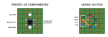

# Korry switch

O botão iluminado quadrado dos aviões, feito em casa: a legenda fica no próprio botão e acende. É uma peça só, **do mesmo tamanho em todo o cockpit**, usada em vários painéis. Por que usar korry e onde ele entra no painel está em [construcao.md](../construcao.md#korry-switches).

**Status: modelo pronto para o primeiro teste de impressão, nada construído.** O corpo sai da impressora em duas cores, a plaquinha é de placa perfurada e não há peça de laser nem placa fabricada.

| Frente | Corte | Peças |
|---|---|---|
|  |  |  |

## Arquivos

| Arquivo | O que é |
|---|---|
| [`korry.scad`](korry.scad) | O modelo no [OpenSCAD](https://openscad.org/), com as medidas e a legenda nas primeiras linhas. Para as letras saírem certas, instalar a fonte [B612](https://fonts.google.com/specimen/B612) Bold |
| [`stl/korry_preto.stl`](stl/korry_preto.stl) e [`stl/korry_transparente.stl`](stl/korry_transparente.stl) | O corpo do korry de teste (`SAS` / `SEM EC`), nas mesmas coordenadas, para imprimir junto com os dois bicos |
| [`stl/korry_base.stl`](stl/korry_base.stl) | A base, que fica atrás do painel. Preta, um bico só |
| [`stl/korry_teste.stl`](stl/korry_teste.stl) | O teste de folga: 5 encaixes de 0,1 a 0,3 mm e um pedaço do corpo |
| [`placa_perfurada.js`](placa_perfurada.js) | Gera [`placa_perfurada.svg`](placa_perfurada.svg), a montagem da plaquinha: `node hardware/korry/placa_perfurada.js` |
| [`korry.svg`](korry.svg) | O desenho da primeira especificação, com a tampa de acrílico: os quatro estados da legenda continuam valendo |

Para gerar um STL com outra legenda: `openscad -D 'peca="preto"' -D 'texto_cima="RCS"' -D 'texto_baixo="SEM MP"' -o korry_preto.stl korry.scad`, e o mesmo com `peca="transparente"`. Com `texto_baixo=""`, a legenda é única.

## Referências

- **Aparência:** o botão START do A320, com a legenda em duas metades: em cima `AVAIL`, só as letras; embaixo `ON`, dentro de uma caixa. Cada metade acende sozinha, na sua cor. Apagadas, as legendas continuam legíveis.
- **Circuito:** uma plaquinha atrás do corpo, com o botão e os LEDs, e um conector de poucos pinos saindo por trás.

## Onde vai

Na [versão B do cockpit](../construcao.md#cockpit-versão-b) são 35:

| Painel | Korry | Legenda |
|---|---|---|
| Voo | 14 | 10 modos do SAS: o marcador da navball com a palavra embaixo, LED azul e verde. SAS, RCS e FBW: duas metades. TRAVA ALT: uma legenda |
| Ação executiva | 6 | Os scripts: POUSO e cinco vagos, LED vermelho e verde (âmbar com os dois) |
| Editor de manobras | 3 | PRO, NRM e RAD: uma legenda, acesa no eixo escolhido |
| Action groups | 4 | PARAQUEDAS, SOLAR, ANTENAS e CARGA: uma legenda, verde |
| Acelerador | 3 | TREM, FREIOS e LUZES: uma legenda, verde |
| Recursos e EVA | 2 | JATO e LUZ: uma legenda, verde |
| Câmera | 2 | MAPA e IVA: uma legenda, branca. O IVA com capa |
| Tempo | 1 | FISICO: uma legenda, branca |

Os botões que não têm luz para mostrar (os action groups 1 a 10, NOVO, APAGAR, CIRC) viraram botões de metal comuns.

## Medidas

| O quê | Medida | Observação |
|---|---|---|
| Frente | **22,5 × 22,5 mm** | Igual em todos |
| Furo no painel | 23 × 23 mm | 0,25 mm de folga por lado. Conferir na plaquinha de teste da laser, que queima um pouco em volta do corte |
| Saliência na frente do painel | 3 mm | A parte transparente com a legenda |
| Corpo | 21 mm de fundo | Da frente até os ressaltos de trás |
| Base | 25,3 × 25,3 mm, 16 mm de fundo | Cabe no passo de 25,5 mm entre korry vizinhos |
| Atrás do painel | ~20 mm | Até os ganchos atrás da plaquinha. Somar o conector e o cabo |
| Distância entre korry vizinhos | 3 mm | De borda a borda |
| Legenda de cima | letras de 3 mm | B612 Bold |
| Legenda de baixo | letras de 2,4 mm, numa caixa de 15 × 5,6 mm | Como o `ON` do A320 |
| Legenda única | letras de 3 mm, centradas | Sem a divisória |
| Plaquinha | 25,4 × 25,4 mm | 10 × 10 furos de placa perfurada |

## Peças

- **Corpo**, impresso em duas cores numa peça só, de frente para baixo na mesa:
  - **Preto:** as paredes de 1 mm, uma camada de 0,6 mm na frente com a legenda vazada, a divisória que separa a luz das duas metades e o pino que aperta o botão tátil. Dois ressaltos nos lados correm nos trilhos da base e seguram o corpo.
  - **Transparente:** as letras da legenda, nos furos da camada preta, e 2,4 mm atrás dela, divididos em dois pela divisória. Apagada, a legenda aparece clara; acesa, na cor do LED.
- **Base:** um tubo preto atrás do painel, com os trilhos por onde o corpo desliza e dois ganchos que prendem a plaquinha. Fica colada atrás do painel, ou presa numa grade impressa para o grupo todo (os 10 modos do SAS numa peça), parafusada no painel. Não leva os parafusos M2 da primeira especificação: com 3 mm entre korry, as abas não cabem.
- **Plaquinha:** placa perfurada, com o botão tátil e os LEDs (abaixo).
- **Botão tátil:** 6 × 6 × 5 mm. A mola dele devolve o corpo. O curso é curto, como no botão do avião.

## A plaquinha em placa perfurada

Placa perfurada verde de dupla face, com ilhas isoladas e furos de 2,54 mm. Um pedaço de 10 × 10 furos para cada korry. O modelo foi ajustado para essa grade: o pino cai no centro do botão, e os LEDs, no centro de cada metade.



1. **Cortar** um quadrado de 10 × 10 furos, riscando com estilete na linha de furos de fora e quebrando. Lixar as bordas.
2. **Botão tátil** no meio, ocupando 4 colunas por 3 linhas de furos: as pernas entram na grade como numa protoboard.
3. **LEDs de 3 mm**, um acima e outro abaixo do botão, a 2 linhas de distância. O catodo (perna curta, lado chato) vai para a direita, olhando a frente.
4. **Conector JST-XH de 4 vias** no verso, de pé, na coluna da borda. Ou 4 fios soldados direto.
5. **Fios no verso**, com fio fino encapado (wire-wrap) de ilha em ilha, como no desenho.

- **Botão:** ligar duas pernas em diagonal. Assim funciona em qualquer botão 6 × 6, seja qual for o par ligado por dentro.
- **Modos do SAS:** o LED azul e verde (3 pernas) vai na posição do LED de cima: azul no LC, verde no LB, catodo no GND. A ordem das pernas muda de fabricante para fabricante: testar antes de soldar.
- **Korry sem luz:** só o botão e 2 fios.
- **Bordas:** com 0,1 mm entre plaquinhas vizinhas, as meias-ilhas da borda não podem ter solda nem fio.

## Circuito

```
  módulo                               korry
  ──────                               ─────
  INn   ─────────────── 2 BTN ────┐
                                  └─[ tátil ]──┐
  LEDn  ──[1 kΩ]─────── 3 LC ───►|─ LED de cima ─┤
  LEDm  ──[1 kΩ]─────── 4 LB ───►|─ LED de baixo ┤
  GND   ─────────────── 1 GND ─────────────────┘
```

- **Não tem CI nem resistor no korry.** O pull-up da entrada e os resistores dos LEDs já estão no módulo (ver o [README do hardware](../README.md#no-módulo)). O korry é só botão, LEDs e fios.
- **Conector de 4 pinos:** 1 GND, 2 BTN, 3 LC (LED de cima), 4 LB (LED de baixo). JST-XH de 4 vias (passo de 2,5 mm) no verso da plaquinha, ou 4 fios soldados direto. O [módulo médio](../README.md#pcb-do-módulo-médio) já tem 12 jacks JST-XH nessa ordem: o korry do jack Kk usa a entrada IN(k−1) e as saídas LED(2k−2) e LED(2k−1).
- **Apertado lê 0**, como qualquer botão dos módulos.
- **Cada korry gasta 1 entrada e 0, 1 ou 2 saídas de LED:**
  - duas metades: 2 saídas;
  - legenda única acesa: 1 saída, com os dois LEDs em paralelo nela;
  - legenda única sem luz (NOVO, APAGAR, CIRC): nenhuma, e os LEDs nem são montados;
  - legenda única de duas cores (os modos do SAS): 2 saídas, com um LED azul e verde de catodo comum. O pino 3 (LC) acende o azul, o 4 (LB) o verde; o conector e o circuito não mudam.
- **A cor é a do LED**, escolhida na montagem, porque a tampa é branca. Uma cor fixa por metade, das cores da [identidade visual](../identidade_visual.md#cores-das-luzes): verde, azul, branco, âmbar ou vermelho. Os modos do SAS têm as duas cores no mesmo LED. A exceção são os korry de eixo do editor, nas cores das alças do nó no KSP (verde-amarelo, magenta e ciano), porque a cor ali diz qual é o eixo, e não um estado.

### Brilho

Com o resistor de 1 kΩ do módulo, cada LED recebe uns 3 mA (uns 2 mA os brancos). Atrás de 3 mm de acrílico leitoso pode ser pouco. O módulo médio usa 220 Ω, uns 13 mA por LED: bem mais forte, mas passa do limite do 74HC595 com os 8 LEDs dele acesos juntos.

1. Testar primeiro com 1 kΩ, no escuro e de dia.
2. Se ficar fraco, trocar o resistor daquela saída no módulo por 470 Ω: uns 6 mA por LED.
3. Não passar de uns 8 mA por LED: cada 74HC595 aguenta 70 mA no total, e com 8 LEDs acesos juntos 8 mA já dá 64 mA.
4. Na legenda única com dois LEDs na mesma saída, a corrente se divide entre os dois: é o caso que mais pede 470 Ω.

## O que as luzes dizem

Como em todo o painel, **a luz mostra o estado do jogo, nunca o toque**. O korry só avisa "apertei" (`BTN SAS 1`); a ponte decide e o LED acende quando o jogo confirma. O firmware não muda: já manda botões e acende LEDs.

| Metade | Acende quando | Exemplo |
|---|---|---|
| Cima | O sistema está ligado no jogo | `SAS` verde: o SAS está ligado |
| Baixo, na caixa | Algo pede atenção | `FAULT` âmbar: o pedido foi recusado, por exemplo a nave não tem SAS. A ponte acende por uns segundos |
| Única | O estado ou modo está escolhido | `PRO` verde-amarelo: o encoder mexe no pró-grado |
| Única, duas cores | Azul: o modo foi escolhido e ainda não assumiu. Verde: assumiu | Modo do SAS: azul com a nave virando, verde com ela no marcador |

## Como imprimir

Na FlashForge Inventor, que tem dois bicos, com o FlashPrint:

1. **Teste de folga** ([`korry_teste.stl`](stl/korry_teste.stl)), só em preto. A folga em que o pedaço de corpo desliza sem balançar vai para a variável `folga` do `korry.scad`, e a base é gerada de novo.
2. **Um korry de teste:** abrir [`korry_preto.stl`](stl/korry_preto.stl) e [`korry_transparente.stl`](stl/korry_transparente.stl) juntos e aceitar quando o FlashPrint perguntar se é um modelo de duas cores, para as partes ficarem no lugar. PLA preto num bico, transparente no outro.
3. **Torre de limpeza** (*wipe wall*) ligada, para o transparente não sair sujo de preto.
4. Camada de 0,12 mm, 3 perímetros, sem suporte. O corpo já está de frente para baixo. A base, em preto, também sem suporte.

**O que pode dar errado no teste:**

- **Letras finas sumindo:** o `SEM EC` tem 2,4 mm, e os traços ficam perto da largura do bico. Se falhar, `letra_baixo = 2.8`, ou ligar a opção de paredes finas no FlashPrint.
- **Luz vazando de uma metade para a outra:** a divisória tem 1 mm. Se vazar, `divisoria_e = 1.6`.
- **Toque duro ou curto:** o botão tátil anda só 0,25 mm. Se não agradar, trocar por um microswitch de alavanca.

## Lista de peças (um korry)

- Corpo impresso em PLA preto e transparente, e base em PLA preto.
- 1 botão tátil 6 × 6 × 5 mm.
- 0 a 2 LEDs de 3 mm, difusos, de alto brilho, na cor da legenda. Nos modos do SAS, 1 LED azul e verde de 3 mm, difuso, de catodo comum.
- 1 pedaço de 10 × 10 furos de placa perfurada de dupla face.
- 1 conector JST-XH de 4 vias (ou 4 fios) e fio fino encapado para as ligações.

## Ordem para fazer

1. **Teste de folga** e ajuste da `folga` no modelo.
2. **Um korry de teste**, ligado direto num pino do Mega como na [fase 2](../../docs/fase2.md): a legenda, o clique, a folga do corpo na base e o brilho, com 1 kΩ e com 470 Ω.
3. **Os 35**, cada um com a sua legenda, inclusive os ícones dos modos do SAS, depois que o teste der certo.

## A decidir

- A folga, depois do teste.
- Se o curso do botão tátil agrada, ou se vale um microswitch.
- Colar a base atrás do painel ou fazer uma grade impressa por grupo.
- Os ícones dos modos do SAS no modelo (hoje o `korry.scad` só faz letras).
